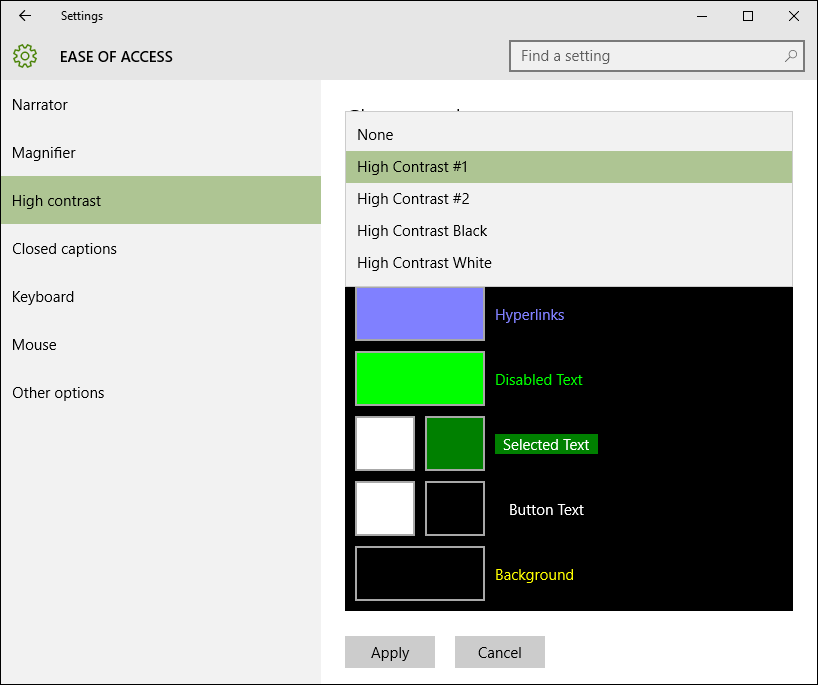
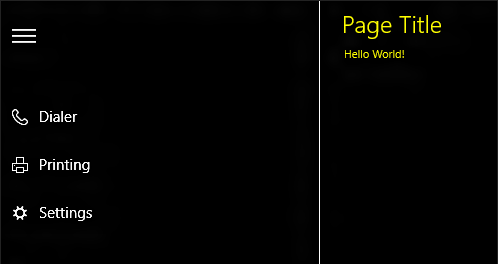

# High-contrast themes  

Describes the steps needed to ensure your Universal Windows Platform (UWP) app is usable when a high-contrast theme is active.

A UWP app supports high-contrast themes by default. If a user has chosen that they want the system to use a high-contrast theme from system settings or accessibility tools, the framework automatically uses colors and style settings that produce a high-contrast layout and rendering for controls and components in the UI.

This default support is based on using the default themes and templates. These themes and templates make references to system colors as resource definitions, and the resource sources change automatically when the system is using a high-contrast mode. However, if you use custom templates, themes, and styles for your control, be careful that you do not disable the built-in support for high contrast. If you use one of the XAML designers for Microsoft Visual Studio for styling, the designer generates a separate, high-contrast theme alongside the primary theme whenever you define a template that is significantly different from the default template. The separate theme dictionaries go into the [**ThemeDictionaries**](https://msdn.microsoft.com/library/windows/apps/windows.ui.xaml.resourcedictionary.themedictionaries.aspx) collection, a dedicated property of a [**ResourceDictionary**](https://msdn.microsoft.com/library/windows/apps/BR208794) element.

For more info on themes and control templates, see [Quickstart: Control templates](https://msdn.microsoft.com/library/windows/apps/xaml/Hh465374). It's often very informative to look at the XAML resource dictionaries and themes for specific controls and see how the themes are constructed and how they reference resources that are similar but different for each possible high-contrast setting.

## Theme dictionaries

When you need to change a color from its system default or need to add images as decoration, such as a background image, create a **ThemeDictionaries** collection for your app.

* Start by creating the proper plumbing, if it doesn't already exist. In App.xaml, create a **ThemeDictionaries** collection :

``` xaml
 <Application.Resources>
    <ResourceDictionary>
        <ResourceDictionary.ThemeDictionaries>
            <!-- Default is a fallback if a more precise theme isn't called out below -->
            <ResourceDictionary x:Key="Default">

            </ResourceDictionary>
            <!-- HighContrast is used in any high contrast theme -->
            <ResourceDictionary x:Key="HighContrast">

            </ResourceDictionary>
        </ResourceDictionary.ThemeDictionaries>
    </ResourceDictionary>
</Application.Resources
```

* **HighContrast** is not the only available key name. There's also **HighContrastBlack**, **HighContrastWhite**, and **HighContrastCustom**. In most cases, **HighContrast** is all you need.
* In **Default**, create the type of [**Brush**](http://msdn.microsoft.com/library/windows/apps/xaml/windows.ui.xaml.media.brush.aspx) you need, usually a **SolidColorBrush**. Give it a **x:Key** name specific to what it is being used for:<br/>
    `<SolidColorBrush x:Key="BrandedPageBackground" />`
* Assign the **Color** you want for it:<br/>
    `<SolidColorBrush x:Key="BrandedPageBackground" Color="Red" />`
* Copy that **Brush** into **HighContrast** :

``` xaml
<Application.Resources>
    <ResourceDictionary>
        <ResourceDictionary.ThemeDictionaries>
            <!-- Default is a fallback if a more precise theme isn't called out below -->
            <ResourceDictionary x:Key="Default">
                <SolidColorBrush x:Key="BrandedPageBackground" Color="Red" />
            </ResourceDictionary>
            <!-- HighContrast is used in any high contrast theme -->
            <ResourceDictionary x:Key="HighContrast">
                <SolidColorBrush x:Key="BrandedPageBackground" Color="Red" />
            </ResourceDictionary>
        </ResourceDictionary.ThemeDictionaries>
    </ResourceDictionary>
</Application.Resources>
```

* Determine what color your **Brush** should be and modify it in **HighContrast**.

Determining a color for high contrast requires a bit of learning. The plumbing you've created above makes it easy to update.

## High-contrast colors

Users can switch to high-contrast using the settings page. There are 4 high-contrast themes by default. Once the user selects an option, the page shows a preview of how apps will likely look.

<br/>
_High-contrast settings_

 Every square on the preview can be clicked to change its value. Every square also directly maps to a system resource.

<br/>
_High-contrast resources_

If you prefix the names called out above with _SystemColor_ and postfix them with _Color_, for example: **SystemColorWindowTextColor**, these will dynamically update to match what the user specified. This frees you from having to pick a specific color for high contrast. Instead, pick a system resource that corresponds to what the color is being used for. In the above example, we named our page background color to be **SolidColorBrushBrandedPageBackground**. Since this will be used for a background, we can map this to the **SystemColorWindowColor** in high contrast:

``` xaml
<Application.Resources>
    <ResourceDictionary>
        <ResourceDictionary.ThemeDictionaries>
            <!-- Default is a fallback if a more precise theme isn't called out below -->
            <ResourceDictionary x:Key="Default">
                <SolidColorBrush x:Key="BrandedPageBackground" Color="Red" />
            </ResourceDictionary>
            <!-- HighContrast is used in any high contrast theme -->
            <ResourceDictionary x:Key="HighContrast">
                <SolidColorBrush x:Key="BrandedPageBackground" Color="{ThemeResource SystemColorWindowColor}" />
            </ResourceDictionary>
        </ResourceDictionary.ThemeDictionaries>
    </ResourceDictionary>
</Application.Resources>
```

If you stick to the palette of 8 high contrast colors, you don't have to create any additional high contrast **ResourceDictionaries**. This limited palette can often present difficult challenges in representing complex visual states. Often, adding a border to an area only in high contrast can help clarify a situation.

### DO's and DON'Ts

* DO test in high-contrast mode early and often.
* DO use the named colors for their intended purpose.
* DO put primitives like **Color**, **Brush**, and **Thickness** inside of **ThemeDictionaries**. Avoid putting more complex resources like **Style** elements in them. The following example works fine:

``` xaml
<Application.Resources>
    <ResourceDictionary>
        <ResourceDictionary.ThemeDictionaries>
            <!-- Default is a fallback if a more precise theme isn't called out below -->
            <ResourceDictionary x:Key="Default">
                <SolidColorBrush x:Key="BrandedPageBackground" Color="Red" />
            </ResourceDictionary>
            <!-- HighContrast is used in any high contrast theme -->
            <ResourceDictionary x:Key="HighContrast">
                <SolidColorBrush x:Key="BrandedPageBackground" Color="{ThemeResource SystemColorWindowColor}" />
            </ResourceDictionary>
        </ResourceDictionary.ThemeDictionaries>

        <Style x:Key="MyButtonStyle" TargetType="Button">
            <Setter Property="Foreground" Value="{ThemeResource BrandedPageBackground}" />
        </Style>
    </ResourceDictionary>
</Application.Resources>

...

<Button Style="{StaticResource MyButtonStyle}" />
```

* DO use high-contrast foreground colors for foreground UI elements.
* DO use high-contrast colors with their defined color pair. For example, always use **BUTTONTEXT** with **BUTTONFACE**, especially in a foreground/background situation.
* DO use the recommended high-contrast color pairing for a particular UI element to ensure the required 14:1 contrast ratio is met.
* DON'T break apart high-contrast color pairs or arbitrarily mix and match high-contrast colors. This will often create invisible UI for at least one of the pre-installed high contrast themes.
* DON'T put any **Brush** objects that you create outside a **ThemeDictionaries** collection.
* DON'T ever use **StaticResource** to reference a resource in a **ThemeDictionaries** collection. This will appear to work until the user changes themes while your app is running. Use **ThemeResource** instead.
* DON'T use hard coded color values.
* DON'T use a color just because you like it.

See [XAML theme resources](https://msdn.microsoft.com/windows/uwp/controls-and-patterns/xaml-theme-resources) for more information.

## When to use borders
In high-contrast mode, add a borders to a UI element where it is necessary to keep a recognizable boundary shape on the item. Use borders to differentiate between the content areas of navigation, actions, and content.

<br/>
_A navigation pane separated from the rest of the page_

If a UI element _does not_ have a border or background by default, do not add a border or background to the default state in high-contrast mode.

If a UI element _does_ have a border by default, then retain the border in high-contrast mode.

Overlapping or adjacent colors should be distinguishable from one another, but they do not necessarily have to meet the color contrast ratio of 14:1. However, best practice is a 3:1 contrast ratio for these types of scenarios.

If high-contrast background colors are used to differentiate overlapping UI elements, the only guaranteed method for ensuring contrast between these elements is to introduce borders.

## Detecting when a high-contrast theme is enabled  
Use members of the [**AccessibilitySettings**](https://msdn.microsoft.com/library/windows/apps/BR242237) class to detect the current settings for high-contrast themes. The [**HighContrast**](https://msdn.microsoft.com/library/windows/apps/BR242237_highcontrast) property determines whether a high-contrast theme is currently selected. If **HighContrast** is set to **true**, then the next step is to check the value of the [**HighContrastScheme**](https://msdn.microsoft.com/library/windows/apps/BR242237_highcontrastscheme) property to get the name of the high-contrast theme that is used. "High Contrast White" and "High Contrast Black" are typically values for **HighContrastScheme** that your code should respond to. XAML-defined [**ResourceDictionary**](https://msdn.microsoft.com/library/windows/apps/BR208794) keys can't have spaces, so the keys for these themes in a resource dictionary are typically "HighContrastWhite" and "HighContrastBlack" respectively. You should also have fallback logic for a default high-contrast theme in case the value is some other string. [XAML high contrast sample](http://go.microsoft.com/fwlink/p/?linkid=254993) shows the logic for this.

> [!NOTE] Make sure you call the [**AccessibilitySettings**](https://msdn.microsoft.com/library/windows/apps/BR242237) constructor from a scope where the app is initialized and is already displaying content.

Apps can switch to using high-contrast resource values while the app is running. This works so long as the resources are requested using the [{ThemeResource} markup extension](https://msdn.microsoft.com/library/windows/apps/Mt185591) in the style or template XAML. The default themes (generic.xaml) all use this {ThemeResource} markup extension technique, so you'll get this behavior if you're using default control themes. Custom controls or custom control styling can do this if you've used this {ThemeResource} markup extension resource technique in your custom templates and styles also.

## Related topics  
* [Accessibility](accessibility.md)
* [UI contrast and settings sample](http://go.microsoft.com/fwlink/p/?linkid=231539)
* [XAML accessibility sample](http://go.microsoft.com/fwlink/p/?linkid=238570)
* [XAML high contrast sample](http://go.microsoft.com/fwlink/p/?linkid=254993)
* [**AccessibilitySettings**](https://msdn.microsoft.com/library/windows/apps/BR242237)


<!--HONumber=Jun16_HO3-->


