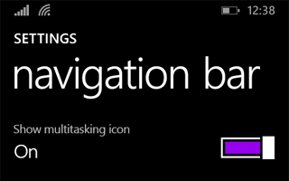
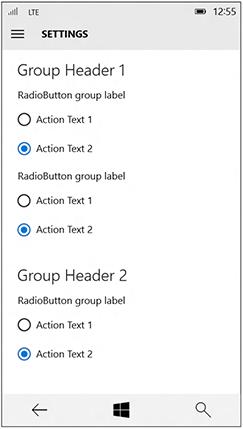

# Guidelines for app settings

App settings are the user-customizable portions of your app and live within an app settings page. For example, app settings in a news reader app might let the user specify which news sources to display or how many columns to display on the screen, while a weather app's settings could let the user choose between Celsius and Fahrenheit as the default unit of measurement. This article describes best practices for creating and displaying app settings.

## Should I include a settings page in my app?

Here are examples of app options that belong in an app settings page: 

-   Configuration options that affect the behavior of the app and don't require frequent readjustment, like choosing between Celsius or Fahrenheit as default units for temperature in a weather app, changing account settings for a mail app, settings for notifications, or accessibility options.
-   Options that depend on the user's preferences, like music, sound effects, or color themes.
-   App information that isn't accessed very often, such as privacy policy, help, app version, or copyright info.

Commands that are part of the typical app workflow (for example, changing the brush size in an art app) shouldn't be in a settings page. To learn more about command placement, see [Command design basics](https://msdn.microsoft.com/library/windows/apps/dn958433).

## General recommendations

-   Keep settings pages simple and make use of binary (on/off) controls. A [toggle switch](../controls-and-patterns/toggles.md) is usually the best control for a binary setting.
-   For settings that let users choose one item from a set of up to 5 mutually exclusive, related options, use [radio buttons](../controls-and-patterns/radio-button.md).
-   Create an entry point for all app settings in your app setting's page.
-   Keep your settings simple. Define smart defaults and keep the number of settings to a minimum.
-   When a user changes a setting, the app should immediately reflect the change.
-   Don't include commands that are part of the common app workflow.

## Entry point

The way that users get to your app settings page should be based on your app's layout.

**Navigation pane**

For a nav pane layout, app settings should be the last item in the list of navigational choices and be pinned to the bottom:

**App bar**

If you're using an app bar or tool bar, which is usually part of a hub or tabs/pivots navigational layout, place the entry point last item in the "More" flyout menu. If greater discoverability for the settings entry point is important for your app, place the entry point directly on the app bar and not within the "More" flyout menu.

**Hub**

If you're using a hub layout, the entry point for app settings should be placed inside the "More" flyout menu of an app bar.

**Tabs/pivots**

For a tabs or pivots layout, we don't recommended placing the app settings entry point as one of the top items within the navigation. Instead, the entry point for app settings should be placed inside the "More" flyout menu of an app bar.

**Master-details**

Instead of burying the app settings entry point deeply within a master-details pane, make it the last pinned item on the top level of the master pane.

## Layout

On both desktop and mobile, the app settings window should open full-screen and fill the whole window. If your app settings menu has between up to four top-level groups, those groups should cascade down one column.

Desktop:

Mobile:

## "About" section and "Give feedback" button

If you need an "About this app" section in your app, create a dedicated app settings page for that. If you want a "Give Feedback" button, place that toward the bottom of the "About this app" page.

"Terms of Use" and "Privacy Statement" should be [hyperlink buttons](../controls-and-patterns/hyperlinks.md) with wrapping text.

## Recommendations

## App settings page content

Once you have a list of items that you want to include in your app settings page, consider these guidelines:

-   Group similar or related settings under one settings label.
-   Try to keep the total number of settings to a maximum of four or five.
-   Display the same settings regardless of the app context. If some settings aren't relevant in a certain context, disable those in the app settings flyout.
-   Use descriptive, one-word labels for settings. For example, name the setting "Accounts" instead of "Account settings" for account-related settings. If you only want one option for your settings and the settings don't lend themselves to a descriptive label, use "Options" or "Defaults."
-   If a setting directly links to the web instead of to a flyout, let the user know this with a visual clue, such as "Help (online)" or "Web forums" styled as a [hyperlink](../controls-and-patterns/hyperlinks.md). Consider grouping multiple links to the web into a flyout with a single setting. For example, an "About" setting could open a flyout with links to your terms of use, privacy policy, and app support.
-   Combine less-used settings into a single entry so that more common settings can each have their own entry. Put content or links that only contain information in an "About" setting.
-   Don't duplicate the functionality in the "Permissions" pane. Windows provides this pane by default and you can't modify it.

##  Add settings content to Settings flyouts

-   Present content from top to bottom in a single column, scrollable if necessary. Limit scrolling to a maximum of twice the screen height.
-   Use the following controls for app settings:

    -   [Toggle switches](../controls-and-patterns/toggles.md): To let users set values on or off.
    -   [Radio buttons](../controls-and-patterns/radio-button.md): To let users choose one item from a set of up to 5 mutually exclusive, related options.
    -   [Text input box](../controls-and-patterns/text-block.md): To let users enter text. Use the type of text input box that corresponds to the type of text you're getting from the user, such as an email or password.
    -   [Hyperlinks](../controls-and-patterns/hyperlinks.md): To take the user to another page within the app or to an external website. When a user clicks a hyperlink, the Settings flyout will be dismissed.
    -   [Buttons](../controls-and-patterns/buttons.md): To let users initiate an immediate action without dismissing the current Settings flyout.
-   Add a descriptive message if one of the controls is disabled. Place this message above the disabled control.
-   Animate content and controls as a single block after the Settings flyout and header have animated. Animate content using the [**enterPage**](https://msdn.microsoft.com/library/windows/apps/br212672) or [**EntranceThemeTransition**](https://msdn.microsoft.com/library/windows/apps/br210288) animations with a 100px left offset.
-   Use section headers, paragraphs, and labels to aid organize and clarify content, if necessary.
-   If you need to repeat settings, use an additional level of UI or an expand/collapse model, but avoid hierarchies deeper than two levels. For example, a weather app that provides per-city settings could list the cities and let the user tap on the city to either open a new flyout or expand to show the settings options.
-   If loading controls or web content takes time, use an indeterminate progress control to indicate to users that info is loading. For more info, see [Guidelines for progress controls](https://msdn.microsoft.com/library/windows/apps/hh465469).
-   Don't use buttons for navigation or to commit changes. Use hyperlinks to navigate to other pages, and instead of using a button to commit changes, automatically save changes to app settings when a user dismisses the Settings flyout.

\[This article contains information that is specific to Universal Windows Platform (UWP) apps and Windows�10. For Windows�8.1 guidance, please download the [Windows�8.1 guidelines PDF](https://go.microsoft.com/fwlink/p/?linkid=258743).\]

## Related topics

* [Command design basics](https://msdn.microsoft.com/library/windows/apps/dn958433)
* [Guidelines for progress controls](https://msdn.microsoft.com/library/windows/apps/hh465469)
            
          
            **For developers (XAML)**
* [Store and retrieve app data](https://msdn.microsoft.com/library/windows/apps/mt299098)
* [
              **EntranceThemeTransition**
            ](https://msdn.microsoft.com/library/windows/apps/br210288) �

�

<!--HONumber=Jun16_HO3-->

