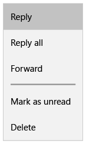
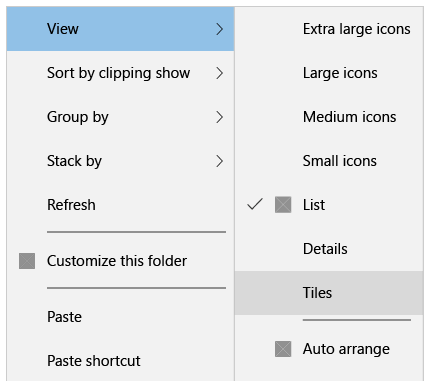
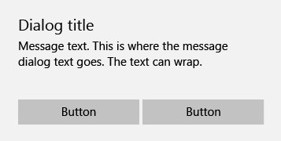

# Menus, dialogs, flyouts and popups

Menus, dialogs, flyouts and popups display transient UI elements that appear when the user requests them or when something happens that requires notification or approval.

<span class="sidebar_heading" style="font-weight: bold;">Important APIs</span>

-   [MenuFlyout class](https://msdn.microsoft.com/library/windows/apps/dn299030)
-   [Flyout class](https://msdn.microsoft.com/library/windows/apps/dn279496)
-   [ContentDialog class](https://msdn.microsoft.com/library/windows/apps/windows.ui.xaml.controls.contentdialog.aspx)

A context menu provides the user with instant actions. It can be filled with text commands. Context menus can be light dismissed by tapping or clicking somewhere outside the menu.

Dialogs are modal UI overlays that provide contextual app information. Dialogs block interactions with the app window until being explicitly dismissed. They often request some kind of action from the user.

A flyout is a lightweight contextual popup that displays UI related to what the user is doing. It includes placement and sizing logic, and can be used to reveal a hidden control, show more detail about an item, or ask the user to confirm an action. Flyouts can be light dismissed by tapping or clicking somewhere outside the popup.


## Is this the right control?

Context menus can be used for:

-   Contextual actions.
-   Commands for an object that must be acted upon but that can't be selected.

Dialogs can be used for:

- Expressing important information that the user must read and acknowledge before proceeding.
- Requesting a clear action from the user or communicating an important message that the user should acknowledge. Examples include:
  - When the user's security might be compromised
  - When the user is about to permanently alter a valuable asset
  - When the user is about to delete a valuable asset
  - To confirm an in-app purchase
- Error messages that apply to the overall app context, such as a connectivity error.
- Questions, when the app needs to ask the user a blocking question, such as when the app can't choose on the user's behalf. A blocking question can't be ignored or postponed, and should offer the user well-defined choices.

Flyouts can be used for:

-   Contextual, transient UI.
-   Warnings and confirmations, including ones related to potentially destructive actions.
-   Displaying more information, such as details or longer descriptions of an item on the page.


## Examples

Here's a typical single-pane context menu with a short list of simple commands. It can scroll if necessary. Use separators as needed to group similar commands.



A cascading context menu can be used for a more comprehensive collection of commands. It features multiple flyout levels and can scroll. Use separators as needed to group similar commands.



This is an example of a full-screen, single-button confirmation dialog. With this kind of dialog, the user is presented with a fair amount of information that they're expected to read before pressing the button to proceed.


Here's an example of a two-button dialog that presents the user with an A/B choice. Generally, the amount of information presented in this dialog is brief.



## Modal vs light dismiss

Dialogs are modal, which means they block all interaction with the app until the user selects a dialog button. To visually reinforce their modal behavior, dialogs draw an overlay layer which partially obscures the temporarily unreachable app UI.

**Note** When Cancel is one of the available dialog options, apps can choose to let users dismiss the dialog by pressing the Escape key. This behavior is not built into the control but is a commonly implemented shortcut.

Flyouts and context menus are light dismiss controls, meaning that users can choose from a variety of actions to quickly dismiss transient UIs. These interactions are intended to be lightweight and non-blocking. Light dismiss actions include
- Click or tap outside the transient UI
- Press the Escape key
- Press the Back button
- Resize the app window
- Change device orientation


## Dialog usage guidelines

-   Clearly identify the issue or the user's objective in the first line of the dialog's text.
-   The dialog title is the main instruction and is optional.
    -   Use a short title to explain what people need to do with the dialog. Long titles do not wrap and are truncated.
    -   If you're using the dialog to deliver a simple message, error or question, you can optionally omit the title. Rely on the content text to deliver that core information.
    -   Make sure that the title relates directly to the button choices.
-   The dialog content contains the descriptive text and is required.
    -   Present the message, error, or blocking question as simply as possible.
    -   If a dialog title is used, use the content area to provide more detail or define terminology. Don't repeat the title with slightly different wording.
-   At least one dialog button must appear.
    -   Buttons are the only mechanism for users to dismiss the dialog.
    -   Use buttons with text that identifies specific responses to the main instruction or content. An example is, "Do you want to allow AppName to access your location?", followed by "Allow" and "Block" buttons. Specific responses can be understood more quickly, resulting in efficient decision making.
-   Error dialogs display the error message in the dialog box, along with any pertinent information. The only button used in an error dialog should be “Close” or a similar action.
-   Don't use dialogs for errors that are contextual to a specific place on the page, such as validation errors (in password fields, for example), use the app's canvas itself to show inline errors.

## Context menus and flyouts

Context menus and flyouts are closely related controls that share interaction behaviors. The primary difference between these controls is in the type of content that they accept.

### MenuFlyout
A context menu, implemented with the MenuFlyout class, can contain [**MenuFlyoutItem**](https://msdn.microsoft.com/library/windows/apps/windows.ui.xaml.controls.menuflyoutitem.aspx), [**ToggleMenuFlyoutItem**](https://msdn.microsoft.com/library/windows/apps/windows.ui.xaml.controls.togglemenuflyoutitem.aspx), [**MenuFlyoutSubItem**](https://msdn.microsoft.com/library/windows/apps/windows.ui.xaml.controls.menuflyoutsubitem.aspx) and [**MenuFlyoutSeparator**](https://msdn.microsoft.com/library/windows/apps/windows.ui.xaml.controls.menuflyoutseparator.aspx). To show any other type of UI, use Flyout.

- **Usage guidelines**
  - Use a separator between groups of commands in a context menu to:
    - Distinguish groups of related commands.
    - Group together sets of commands.
    - Divide a predictable set of commands, such as clipboard commands (Cut / Copy / Paste), from app-specific or view-specific commands.
  -   On laptops and desktops, context menus and tooltips aren't limited to the application window and can paint partially outside of it. If the app tries to render a context menu completely outside of its window, an exception will be thrown.

- **Do's and don'ts**
  -   Keep context menu commands short. Longer commands end up being truncated.
  -   Use sentence capitalization for each command name.
  -   In any context menu, show the fewest possible number of commands.
  -   If direct manipulation of a UI element is possible, avoid placing that command within a context menu. A context menu should be reserved for contextual commands that aren't otherwise discoverable on-screen.

### Flyout

A Flyout is an open-ended container that can show arbitrary UI as its content.  Flyouts don’t have visual parts on their own, they are simply a content control. Flyouts do have a margin and optional scroll bars they add around their content. To style a Flyout, modify its `FlyoutPresenterStyle`.

The following code shows a paragraph of wrapping text and makes the text block accessible to a screen reader.

````xaml
<Flyout>
  <Flyout.FlyoutPresenterStyle>
    <Style TargetType="FlyoutPresenter">
      <Setter Property="ScrollViewer.HorizontalScrollMode" Value="Disabled"/>
      <Setter Property="ScrollViewer.HorizontalScrollBarVisibility" Value="Disabled"/>
      <Setter Property="IsTabStop" Value="True"/>
      <Setter Property="TabNavigation" Value="Cycle"/>
    </Style>
  </Flyout.FlyoutPresenterStyle>
  <TextBlock Style="{StaticResource BodyTextBlockStyle}" Text="Lorem ipsum dolor sit amet, consectetur adipiscing elit, sed do eiusmod tempor incididunt ut labore et dolore magna aliqua. Ut enim ad minim veniam, quis nostrud exercitation ullamco laboris nisi ut aliquip ex ea commodo consequat."/>
</Flyout>
````

### Invocation and placement

Flyouts and context menus are attached to specific controls. When visible, they should be anchored to the invoking object and specify their preferred relative position to the object: Top, Left, Bottom, or Right. Flyout also has a Full placement mode which attempts to stretch the flyout and center it inside the app window.

The [Button class](https://msdn.microsoft.com/library/windows/apps/windows.ui.xaml.controls.button.aspx) includes a `Flyout` property that lets you specify the transient UI that will open when the user clicks or taps the button.

````xaml
<Button Content="Click me">
  <Button.Flyout>
     <Flyout>
        <TextBlock Text="Yay!"/>
     </Flyout>
  </Button.Flyout>
</Button>
````

To open a context menu, users can perform one of the following actions:
- Right click with mouse
- Press and hold with touch
- Type Shift + F10
- Press keyboard menu key
- Press gamepad menu button

To easily open a context menu or flyout in response to any of the above actions, apps can leverage the new [`ContextFlyout`](https://msdn.microsoft.com/library/windows/apps/windows.ui.xaml.uielement.contextflyout.aspx) property on [UIElement](https://msdn.microsoft.com/library/windows/apps/windows.ui.xaml.uielement.aspx), the base class for most controls.

````xaml
<Rectangle Height="100" Width="100" Fill="Red">
  <Rectangle.ContextFlyout>
     <MenuFlyout>
        <MenuFlyoutItem Text="Close"/>
     </MenuFlyout>
  </Rectangle.Flyout>
</Rectangle>
````

## Related articles

**For developers**
- [**MenuFlyout class**](https://msdn.microsoft.com/library/windows/apps/dn299030)
- [**Flyout class**](https://msdn.microsoft.com/library/windows/apps/dn279496)
- [**ContentDialog class**](https://msdn.microsoft.com/library/windows/apps/windows.ui.xaml.controls.contentdialog.aspx)


<!--HONumber=Jun16_HO3-->


