# Progress controls

A progress control provides feedback to the user that a long-running operation is underway. A *determinate* progress bar shows the percentage of completion of an operation. An *indeterminate* progress bar, or a progress ring, shows that an operation is underway.

A progress control is read only; it is not interactive.

<span class="sidebar_heading" style="font-weight: bold;">Important APIs</span>

-   [**ProgressBar class**](https://msdn.microsoft.com/library/windows/apps/xaml/windows.ui.xaml.controls.progressbar.aspx)
-   [**IsIndeterminate property**](https://msdn.microsoft.com/library/windows/apps/xaml/windows.ui.xaml.controls.progressbar.isindeterminate.aspx)
-   [**ProgressRing class**](https://msdn.microsoft.com/library/windows/apps/xaml/windows.ui.xaml.controls.progressring.aspx)
-   [**IsActive property**](https://msdn.microsoft.com/library/windows/apps/xaml/windows.ui.xaml.controls.progressring.isactive.aspx)


Windows app: indeterminate progress bar, progress ring, and determinate progress bar

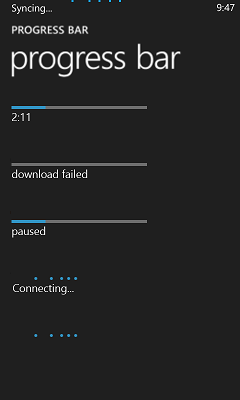

Windows Phone app: status bar progress indicator and progress bars

## Examples

Here's an example of a progress ring control on a splash screen.

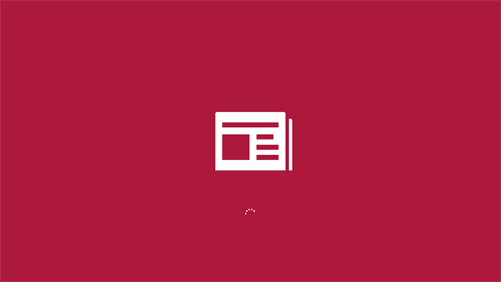

A progress bar is also a good indicator of state or position. A progress bar used for a music track corresponds to the timeline of the song: the bar’s value is the song position; the paused state indicates that playback is paused.


## Is this the right control?

It's not always necessary to show a progress control. Sometimes a task's progress is obvious enough on its own or the task completes so quickly that showing a progress control would be distracting. Here are some points to consider when determining whether you should show a progress control.

-   **Does the operation take more than two seconds to complete?**

    If so, show a progress control as soon as the operation starts. If an operation takes more than two seconds to complete most of the time, but sometimes completes in under two seconds, wait 500ms before showing the control to avoid flickering.

-   **Is the operation waiting for the user to complete a task?**

    If so, don't use a progress bar. Progress bars are for computer progress, not user progress.

-   **Does the user need to know that something is happening?**

    For example, if the app is downloading something in the background and the user didn’t initiate the download, the user doesn’t need to know about it.

-   **Is the operation a background activity that doesn't block user activity and is of minimal (but still some) interest to the user?**

    Use text and ellipses when your app is performing tasks that don't have to be visible all the time, but you still need to show the status.

    

    Use the ellipses to indicate that the task is ongoing. If there are multiple tasks or items, you can indicate the number of remaining tasks. When all tasks complete, dismiss the indicator.

-   **Can you use the content from the operation to visualize progress?**

    If so, don't show a progress control. For example, when displaying /src/assets loaded from the disk, /src/assets appear on the screen one-by-one as they are loaded. Displaying a progress control would provide no benefit; it would just clutter the UI.

-   **Can you determine, relatively, how much of the total work is complete while the operation is progressing?**

    If so, use a determinate progress bar, especially for operations that block the user. Use an indeterminate progress bar or ring otherwise. Even if all the user knows is that something is happening, that’s still helpful.

## Create a determinate progress control

A determinate progress bar shows how much progress the app has made. As work progresses , the bar fills up. If you can estimate remaining amount of work in time, bytes, files, or some other quantifiable units of measure, use a determinate progress bar.

The progress bar provides several properties for setting and determining progress:
- [
              **IsIndeterminate**
            ](https://msdn.microsoft.com/library/windows/apps/xaml/windows.ui.xaml.controls.progressbar.isindeterminate.aspx): Specifies whether the progress bar is indeterminate. Set to **false** to create a determinate progress bar.
- [
              **Minimum**
            ](https://msdn.microsoft.com/library/windows/apps/xaml/windows.ui.xaml.controls.primitives.rangebase.minimum.aspx): The start of the value range. The default is 0.0.
- [
              **Maximum**
            ](https://msdn.microsoft.com/library/windows/apps/xaml/windows.ui.xaml.controls.primitives.rangebase.maximum.aspx): The end of the vlaue range. The default is 1.0. 
- [
              **Value**
            ](https://msdn.microsoft.com/library/windows/apps/xaml/windows.ui.xaml.controls.primitives.rangebase.value.aspx): A number that specifies the current progress. If you're showing the progress of a file download, this value might be the number of bytes downloaded (and then you set Maximum to the total number of bytes to download).
 
The following example shows a value-based determinate progress bar. 

```xaml
<ProgressBar IsIndeterminate="False" Maximum="100" Width="200"/>
```

```csharp
ProgressBar progressBar1 = new ProgressBar();
progressBar1.IsIndeterminate = false;
progressBar1.Maximum = 100;
progressBar1.Width = 200;

// Add the button to a parent container in the visual tree.
stackPanel1.Children.Add(progressBar1);
```

You don't typically specify the value of a progress bar in markup. Instead, you use procedural code or data binding to update the value of the progress bar as a response to some indicator of progress. For example, if your progress bar indicates how many files have been downloaded, you update the value each time another file is downloaded.

## Create an indeterminate progress control

When you can't estimate how much work remains to finish a task and the task doesn't block user interaction, use an indeterminate progress bar or progress ring. Instead of showing a bar that fills up as progress completes, an indeterminate progress bar shows an animation of dots moving from left to right. An indeterminate progress ring shows an animated sequence of dots moving in a circle. 

To make a progess bar indeterminate, set its [**IsIndeterminate**](https://msdn.microsoft.com/library/windows/apps/xaml/windows.ui.xaml.controls.progressbar.isindeterminate.aspx) property to **true**.

```xaml
<ProgressBar IsIndeterminate="True" Width="200"/>
```

```csharp
ProgressBar progressBar1 = new ProgressBar();
progressBar1.IsIndeterminate = true;
progressBar1.Width = 200;

// Add the button to a parent container in the visual tree.
stackPanel1.Children.Add(progressBar1);
```

To show a progress ring in your app, set its [**IsActive**](https://msdn.microsoft.com/library/windows/apps/xaml/windows.ui.xaml.controls.progressring.isactive.aspx) property to **true**.

```xaml
<ProgressRing IsActive="True"/>
```

```csharp
ProgressRing progressRing1 = new ProgressRing();
progressRing1.IsActive = true;

// Add the button to a parent container in the visual tree.
stackPanel1.Children.Add(progressRing1);
```

## Recommendations

-   Use the determinate progress bar when a task is determinate, that is when it has a well-defined duration or a predictable end. For example, if you can estimate remaining amount of work in time, bytes, files, or some other quantifiable units of measure, use a determinate progress bar. Here are some examples of determinate tasks:

    -   The app is downloading a 500k photo and has received 100k so far.
    -   The app is displaying a 15 second advertisement and 2 seconds have elapsed.

    

-   Use the indeterminate progress ring for tasks that are not determinate and are modal (block user interaction).

    

-   Use the indeterminate progress bar for tasks that are not determinate that are non-modal (don't block user interaction).

    

-   Treat partially modal tasks as non-modal if the modal state lasts less than 2 seconds. Some tasks block interaction until some progress has been made, and then the user can start interacting with the app again. For example, when the user performs a search query, interaction is blocked until the first result is displayed. Treat tasks such as these as non-modal and use the indeterminate progress bar style if modal state lasts less than 2 seconds. If modal state can last more than 2 seconds, use the indeterminate progress ring for the modal phase of the task, and use the indeterminate progress bar for the non-modal phase.
-   Consider providing a way to cancel or pause the operation that is in progress, particularly when the user is blocked awaiting the completion of the operation and has a good idea of how much longer the operation has left to run.
-   Don't use the "wait cursor" to indicate activity, because users who use touch to interact with the system won't see it, and those users who use mouse don't need two ways to visualize activity (the cursor and the progress control).
-   Show a single progress control for multiple active related tasks. If there are multiple related items on the screen that are all simultaneously performing some kind of activity, don't show multiple progress controls. Instead, show one that ends when the last task completes. For example, if the app downloads multiple photos, show a single progress control, instead of showing one for every photo.
-   Don't change the location or size of the progress control while the task is running.

### Guidelines for determinate tasks

-   If the operation is modal (blocks user interaction), and takes longer than 10 seconds, provide a way to cancel it. The option to cancel should be available when the operation begins.
-   Space progress updates evenly. Avoid situations where progress increases to over 80% and then stops for a long period of time. You want to speed up progress towards the end, not slow it down. Avoid drastic jumps, such as from 0% to 90%.
-   After setting progress to 100%, wait until the determinate progress bar finishes animating before hiding it.
-   If your task is stopped (by a user or an external condition), but a user can resume it, visually indicate that progress is paused. In JavaScript apps, you do this by using the win-paused CSS style. In C\#/C++/VB apps, you do this by setting the ShowPaused property to true. Provide status text under the progress bar that tells the user what's going on.
-   If the task is stopped and can’t be resumed or has to be restarted from scratch, visually indicate that there's an error. In JavaScript apps, you do this by using the win-error CSS style. In C\#/C++/VB apps, you do this by setting the ShowError property to true. Replace the status text (underneath the bar) with a message that tells the user what happened and how to fix the issue (if possible).
-   If some time (or action) is needed before you can provide determinate progress, use the indeterminate bar first, and then switch to the determinate bar. For example, if the first step of a download task is connecting to a server, you can’t estimate how long that takes. After the connection is established, switch to the determinate progress bar to show the download progress. Keep the progress bar in exactly the same place, and of the same size after the switch.

    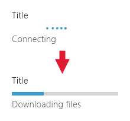

-   If you have a list of items, such as a list of printers, and certain actions can initiate an operation on items in that list (such as installing a driver for one of the printers), show a determinate progress bar next to the item.

    Show the subject (label) of the task above the progress bar and status underneath. Don’t provide status text if what's happening is obvious. After the task completes, hide the progress bar. Use the status text to communicate the new state of an item.

    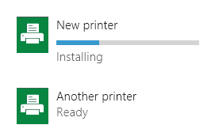

-   To show a list of tasks, align the content in a grid so users can see the status at a glance. Show progress bars for all items, even those that are pending.

    Because the purpose of this list is to show ongoing operations, remove operations from the list when they complete.

    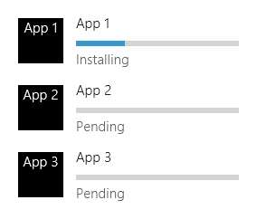

-   If a user initiated a task from the app bar and it blocks user interaction, show the progress control in the app bar.

    If it's clear what the progress bar is showing progress for, you can align progress bar to the top of the app bar and omit the label and status; otherwise, provide a label and status text.

    Disable interaction during the task by disabling controls in the app bar and ignoring input in the content area.

-   Don’t decrement progress. Always increment the progress value. If you need to reverse an action, show the progress of reversal as you would show progress of any other action.
-   Don’t restart progress (from 100% to 0%), unless it’s obvious to the user that a current step or task is not the last one. For example, suppose a task has two parts: downloading some data, and then processing and displaying the data. After the download is complete, reset the progress bar to 0% and begin showing the data processing progress. If it’s unclear to users that there are multiple steps in a task, collapse the tasks into a single 0-100% scale and update status text as you move from one task to the next.

### Guidelines for modal, indeterminate tasks that use the progress ring

-   Display the progress ring in the context of the action: show it near the location where the user initiated the action or where the resulting data will display.
-   Provide status text to the right of the progress ring.
-   Make the progress ring the same color as its status text.
-   Disable controls that user shouldn’t interact with while the task is running.
-   If the task results in an error, hide the progress indicator and status text and display an error message in their place.
-   In a dialog, if an operation must complete before you move to the next screen, place the progress ring just above the button area, left-aligned with the content of the dialog.

    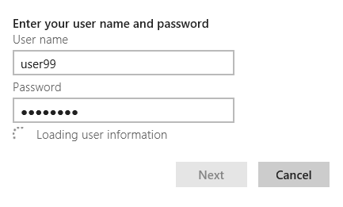

-   In an app window with right-aligned controls, place the progress ring to the left or just above the control that caused the action. Left-align the progress ring with related content.

    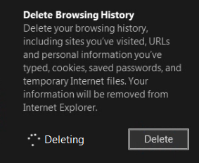

-   In an app window with left-aligned controls, place the progress ring to the right or just under the control that caused the action.

    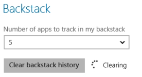

    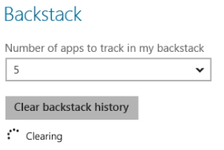

-   If you are showing multiple items, place the progress ring and status text underneath the title of the item. If an error occurs, replace the progress ring and status with error text.

    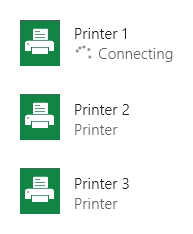

### Guidelines for non-modal, indeterminate tasks that use the progress bar

-   If you show progress in a flyout, place the indeterminate progress bar at the top of the flyout and set its width so that it spans the entire flyout. This placement minimizes distraction but still communicates ongoing activity. Don't give the flyout a title, because a title prevents you from placing the progress bar at the top of the flyout.

    

-   If you show progress in an app window, place the indeterminate progress bar at the top of the app window, spanning the entire window.

    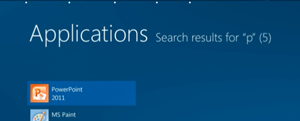

### Guidelines for status text

-   When you use the determinate progress bar, don’t show the progress percentage in the status text. The control already provides that info.
-   If you use text to indicate activity without a progress control, use ellipsis to convey that the activity is ongoing.
-   If you use a progress control, don't use ellipsis in your status text, because the progress control already indicates that the operation is ongoing.

### Guidelines for appearance and layout

-   A determinate progress bar appears as a colored bar that grows to fill a gray background bar. The proportion of the total length that is colored indicates, relatively, how much of the operation is complete.
-   An indeterminate progress bar or ring is made of continually moving colored dots.
-   Choose the progress control's location and prominence based on its importance.

    Important progress controls can serve as a call-to-action, telling the user to resume a certain operation after the system has done its work. Some built-in Windows Phone apps use a status bar progress indicator at the top of the screen for important cases. You can do this, too, and configure it to be determinate or indeterminate.

    Cases that are less critical, such as during downloading, appear smaller and are restricted to one view.

-   Use a label to show the progress value, or to describe the process taking place, or to indicate that the operation has been interrupted. A label is optional, but we highly recommend it.

    To describe the process taking place, use a gerund (an –ing verb), e.g. ‘connecting’, ‘downloading’, or ‘sending’.

    To indicate that progress is paused or has encountered an exception, use past participles, e.g. ‘paused’, ‘download failed’, or ‘canceled’.

-   Determinate progress bar with label and status

    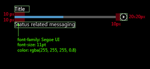

-   Multiple progress bars

    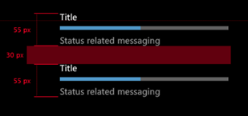

-   Indeterminate progress ring with status text

    

-   Indeterminate progress bar

    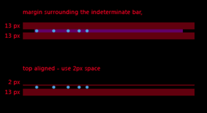

## Additional usage guidance

### Decision tree for choosing a progress style

-   **Does the user need to know that something is happening?**

    If the answer is no, don't show a progress control.

-   **Is info about how much time it will take to complete the task available?**
    -   **Yes:**
            **Does the task take more than two seconds to complete?**
        -   **Yes:** Use a determinate progress bar. For tasks that take longer than 10 seconds, provide a way to cancel the task.
        -   **No:** Don't show a progress control.

    -   **No:**
            **Are users blocked from interacting with the UI until the task is complete?**
        -   **Yes:**
            **Is this task part of a multi-step process where the user needs to know specific details of the operation?**
            -   **Yes:** Use an indeterminate progress ring with status text horizontally centered in the screen.
            -   **No:** Use an indeterminate progress ring without text in the center of the screen.
        -   **No:**
            **Is this a primary activity?**
            -   **Yes:**
            **Is progress related to a single, specific element in the UI?**
                -   **Yes:** Use an inline indeterminate progress ring with status text next to its related UI element.
                -   **No:**
            **Is a large amount of data being loaded into a list?**
                    -   **Yes:** Use the indeterminate progress bar at the top with placeholders to represent incoming content.
                    -   **No:** Use the indeterminate progress bar at the top of the screen or surface.
            -   **No:** Use status text in an upper corner of the screen.

## Related articles


- [**ProgressBar class**](https://msdn.microsoft.com/library/windows/apps/br227529)
- [**ProgressRing class**](https://msdn.microsoft.com/library/windows/apps/br227538)

**For developers (XAML)**
- [Adding progress controls](https://msdn.microsoft.com/library/windows/apps/xaml/hh780651)
- [How to create a custom indeterminate progress bar for Windows Phone](http://go.microsoft.com/fwlink/p/?LinkID=392426)


<!--HONumber=Jun16_HO2-->


