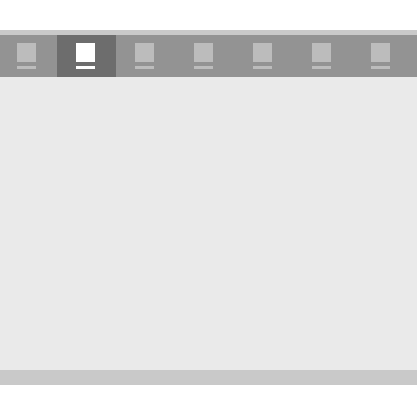
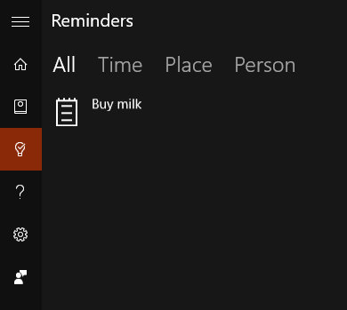
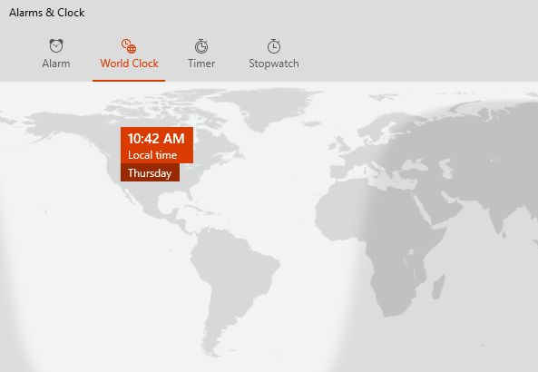

# Pivot and tabs

Pivot controls and the tabs pattern are used for navigating frequently accessed, distinct content categories. The pivots and tabs are made of two or more content panes that have corresponding category headers. The headers persist on-screen and have a selection state that's clearly shown, so users are always aware of which category they're in.


Tabs are a visual variant of Pivot and are built using the [**Pivot**](https://msdn.microsoft.com/library/windows/apps/xaml/windows.ui.xaml.controls.pivot.aspx) control. [
              **Code sample**
            ](https://github.com/Microsoft/Windows-universal-samples/tree/master/Samples/XamlPivot) showing how to customize pivot is available on GitHub.

<span class="sidebar_heading" style="font-weight: bold;">Important APIs</span>

-   [**Pivot class**](https://msdn.microsoft.com/library/windows/apps/dn608241)

## The tab/pivot pattern

When building an app with the tab/pivot pattern, there are a few key design variables to consider.

- **Header labels.**  Headers can have an icon with text or text only.
- **Header alignment.**  Headers can be left-justified or centered.
- **Top-level or sub-level navigation.**  Tabs/pivots can be used for either level of navigation. Optionally, [navigation pane](nav-pane.md) can serve as the primary level with tabs/pivots acting as secondary.
- **Touch gesture support.**  For devices that support touch gestures, you can use one of two interaction sets to navigate between content categories:
    1. Tap on a tab/pivot header to navigate to that category.
    2. Swipe left or right on the content area to navigate to the adjacent category.

## Examples

Default Pivot control in Cortana Reminders.



Tabs pattern in the Alarms & Clock app.



## Create a pivot control

The [**Pivot**](https://msdn.microsoft.com/library/windows/apps/xaml/windows.ui.xaml.controls.pivot.aspx) control comes with the basic functionality described in this section.

This XAML creates a basic pivot control with 3 sections of content.

```xaml
<Pivot x:Name="rootPivot" Title="Pivot Title">
    <PivotItem Header="Pivot Item 1">
        <!--Pivot content goes here-->
        <TextBlock Text="Content of pivot item 1."/>
    </PivotItem>
    <PivotItem Header="Pivot Item 2">
        <!--Pivot content goes here-->
        <TextBlock Text="Content of pivot item 2."/>
    </PivotItem>
    <PivotItem Header="Pivot Item 3">
        <!--Pivot content goes here-->
        <TextBlock Text="Content of pivot item 3."/>
    </PivotItem>
</Pivot>
```

### Pivot items

Pivot is an [**ItemsControl**](https://msdn.microsoft.com/library/windows/apps/xaml/windows.ui.xaml.controls.itemscontrol.aspx), so it can contain a collection of items of any type. Any item you add to the Pivot that is not explicitly a [**PivotItem**](https://msdn.microsoft.com/library/windows/apps/xaml/windows.ui.xaml.controls.pivotitem.aspx) is implicitly wrapped in a PivotItem. Because a Pivot is often used to navigate between pages of content, it's common to populate the [**Items**](https://msdn.microsoft.com/library/windows/apps/xaml/windows.ui.xaml.controls.itemscontrol.items.aspx) collection directly with XAML UI elements. Or, you can set the [**ItemsSource**](https://msdn.microsoft.com/library/windows/apps/xaml/windows.ui.xaml.controls.itemscontrol.itemssource.aspx) property to a data source. Items bound in the ItemsSource can be of any type, but if they aren't explicitly PivotItems, you must define an [**ItemTemplate**](https://msdn.microsoft.com/library/windows/apps/xaml/windows.ui.xaml.controls.itemscontrol.itemtemplate.aspx) and [**HeaderTemplate**](https://msdn.microsoft.com/library/windows/apps/xaml/windows.ui.xaml.controls.pivot.headertemplate.aspx) to specify how the items are displayed.

You can use the [**SelectedItem**](https://msdn.microsoft.com/library/windows/apps/xaml/windows.ui.xaml.controls.pivot.selecteditem.aspx) property to get or set the Pivot's active item. Use the [**SelectedIndex**](https://msdn.microsoft.com/library/windows/apps/xaml/windows.ui.xaml.controls.pivot.selectedindex.aspx) property to get or set the index of the active item.

### Pivot headers

You can use the [**LeftHeader**](https://msdn.microsoft.com/library/windows/apps/xaml/windows.ui.xaml.controls.pivot.leftheader.aspx) and [**RightHeader**](https://msdn.microsoft.com/library/windows/apps/xaml/windows.ui.xaml.controls.pivot.rightheader.aspx) properties to add other controls to the Pivot header.

### Pivot interaction

The control features these touch gesture interactions:

-   Tapping on a pivot item header navigates to that header's section content.
-   Swiping left or right on a pivot item header navigates to the adjacent section.
-   Swiping left or right on section content navigates to the adjacent section.

The control comes in two modes:

**Stationary**

-   Pivots are stationary when all pivot headers fit within the allowed space.
-   Tapping on a pivot label navigates to the corresponding page, though the pivot itself will not move. The active pivot is highlighted.

**Carousel**

-   Pivots carousel when all pivot headers don't fit within the allowed space.
-   Tapping a pivot label navigates to the corresponding page, and the active pivot label will carousel into the first position.
-   Pivot items in a carousel loop from last to first pivot section.

## Recommendations

-   Base the alignment of tab/pivot headers on screen size. For screen widths below 720 epx, center-aligning usually works better, while left-aligning for screen widths above 720 epx is recommended in most cases.
-   Avoid using more than 5 headers when using carousel (round-trip) mode, as looping more than 5 can become confusing.
-   Use the tabs pattern only if your pivot items have distinct icons.
-   Include text in pivot item headers to help users understand the meaning of each pivot section. Icons are not necessarily self-explanatory to all users.


## Related topics

[Navigation design basics](https://msdn.microsoft.com/library/windows/apps/dn958438)


<!--HONumber=Jun16_HO2-->


