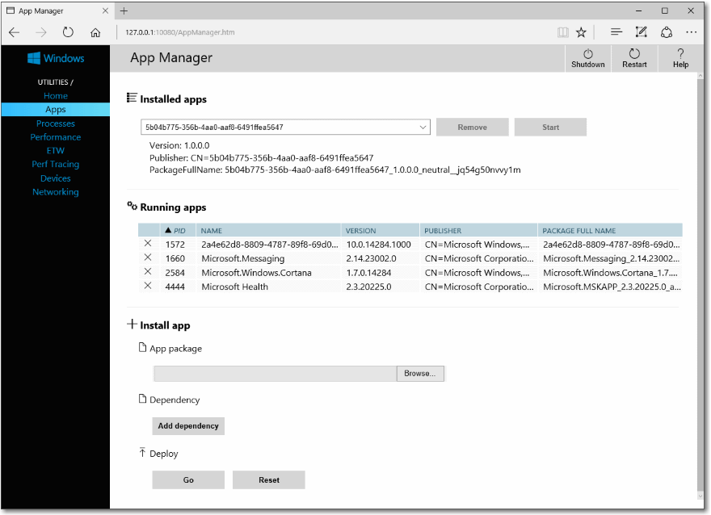
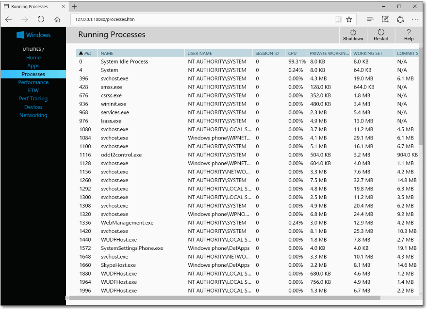
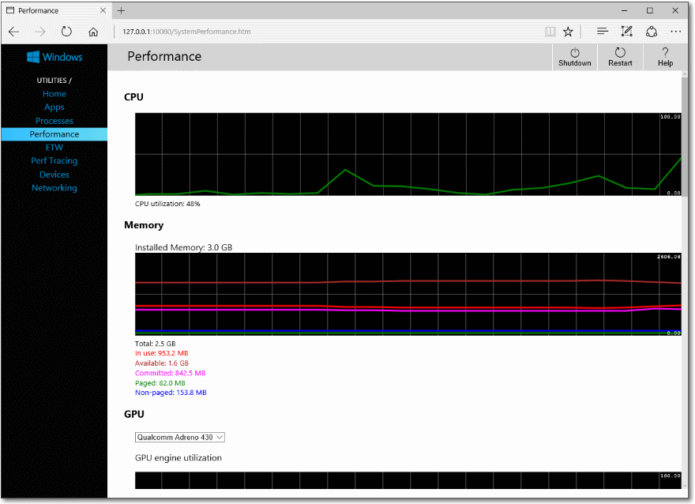
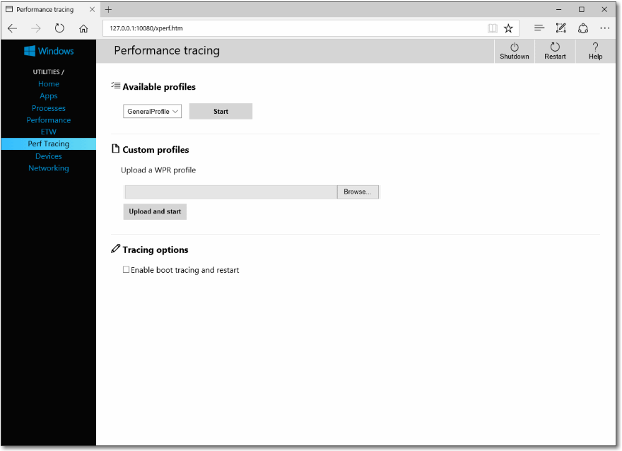
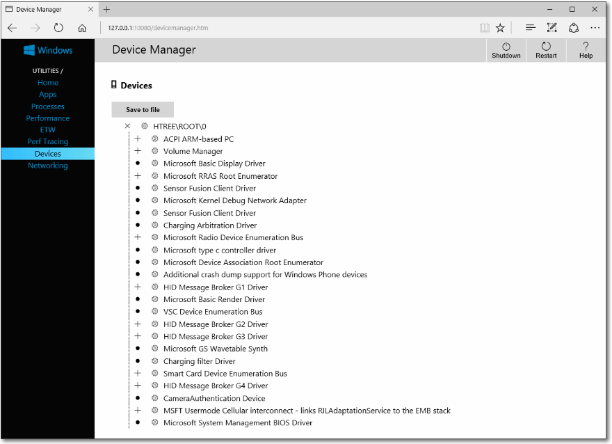
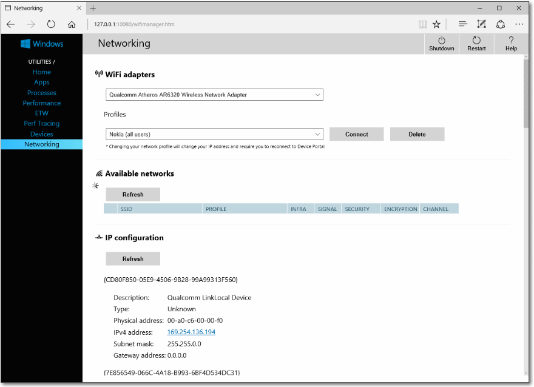

# Windows Device Portal overview

The Windows Device Portal lets you configure and manage your device remotely over a network or USB connection. It also provides advanced diagnostic tools to help you troubleshoot and view the real time performance of your Windows device.

The Device Portal is a web server on your device that you can connect to from a web browser on your PC. If your device has a web browser, you can also connect locally with the browser on your device.

Windows Device Portal is available on each device family, but features and setup vary based on the device's requirements. This article provides a general description of Device Portal and links to articles with more specific information for each device family.

Everything in the Windows Device Portal is built on top of [REST API's](device-portal-api-core.md) that you can use to access the data and control your device programmatically.

## Setup

Each device has specific instructions for connecting to Device Portal, but each requires these general steps:
1. Enable Developer Mode and Device Portal on your device.
2. Connect your device and PC via local network or USB.
3. Navigate to the Device Portal page in your browser. This table shows the ports and protcols used by each device family.

Device family | On by default? | HTTP | HTTPS | USB
--------------|----------------|------|-------|----
HoloLens | Yes, in Dev Mode | 80 (default) | 443 (default) | localhost:10080
IoT | Yes, in Dev Mode | 8080 | Enable via regkey | N/A
Xbox | Enable inside Dev Mode | Disabled | 11443 | N/A
Desktop| Enable inside Dev Mode | Random > 50,000 (xx080) | Random > 50,000 (xx443) | N/A
Phone | Enable inside Dev Mode | 80| 443 | localhost:10080

For device-specific setup instructions, see:
- [Device Portal for HoloLens](https://dev.windows.com/holographic/using_the_windows_device_portal)
- [Device Portal for IoT](http://ms-iot.github.io/content/win10/tools/DevicePortal.htm)
- [Device Portal for Mobile](device-portal-mobile.md#set-up-device-portal-on-window-phone)
- [Device Portal for Xbox](device-portal-xbox.md)
- [Device Portal for Desktop](device-portal-desktop.md#set-up-device-portal-on-windows-desktop)

## Features

### Toolbar and navigation

The toolbar at the top of the page provides access to commonly used status and features.
- **Shutdown**: Turns off the device.
- **Restart**: Cycles power on the device.
- **Help**: Opens the help page.

Use the links in the navigation pane along the left side of the page to navigate to the available management and monitoring tools for your device.

Tools that are common across devices are described here. Other options might be available depending on the device. For more info, see the specific page for your device.

### Home

Your Device Portal session starts at the home page. The home page typically has information about the device, such as name and OS version, and preferences that you can set for the device.

### Apps

Provides install/uninstall and management functionality for AppX packages and bundles on your device.



- **Installed apps**: Remove and start apps.
- **Running apps**: Lists apps that are running currently.
- **Install app**: Select app packages for installation from a folder on your computer or network.
- **Dependency**: Add dependencies for the app you are going to install.
- **Deploy**: Deploy the selected app and dependencies to your device.

**To install an app**

1.  When you've [created an app package](https://msdn.microsoft.com/library/windows/apps/xaml/hh454036(v=vs.140).aspx), you can remotely install it onto your device. After you build it in Visual Studio, an output folder is generated.

    
2.  Click browse and find your app package (.appx).
3.  Click browse and find the certificate file (.cer). (Not required on all devices.)
4.  Add dependencies. If you have more than one, add each one individually.     
5.  Under **Deploy**, click **Go**. 
6.  To install another app, click the **Reset** button to clear the fields.


**To uninstall an app**

1.  Ensure that your app is not running. 
2.  If it is, go to 'running apps' and close it. If you attempt to uninstall while the app is running, it will cause issues when trying to re-install the app. 
3.  Once you're ready, click **Uninstall**.

### Processes

Shows details about currently running processes. This includes both apps and system processes.

Much like the Task Manager on your PC, this page lets you see which processes are currently running as well as their memory usage.  On some platforms (Desktop, IoT, and HoloLens) you can terminate processes.



### Performance

Shows real-time graphs of system diagnostic info, like power usage, frame rate, and CPU load.

These are the available metrics:
- **CPU**: Percent of total available
- **Memory**: Total, in use, available committed, paged, and non-paged
- **GPU**: GPU engine utilization, percent of total available
- **I/O**: Reads and writes
- **Network**: Received and sent



### Event Tracing for Windows (ETW)

Manages realtime Event Tracing for Windows (ETW) on the device.


Check **Hide providers** to show the Events list only.
- **Registered providers**: Select the ETW provider and the tracing level. Tracing level is one of these values:
    1. Abnormal exit or termination
    2. Severe errors
    3. Warnings
    4. Non-error warnings
    5. Detailed trace (*)

Click or tap **Enable** to start tracing. The provider is added to the **Enabled Providers** dropdown.
- **Custom providers**: Select a custom ETW provider and the tracing level. Identify the provider by its GUID. Don't include brackets in the GUID.
- **Enabled providers**: Lists the enabled providers. Select a provider from the dropdown and click or tap **Disable** to stop tracing. Click or tap **Stop all** to suspend all tracing.
- **Providers history**: Shows the ETW providers that were enabled during the current session. Click or tap **Enable** to activate a provider that was disabled. Click or tap **Clear** to clear the history.
- **Events**: Lists ETW events from the selected providers in table format. This table is updated in real time. Beneath the table, click the **Clear** button to delete all ETW events from the table. This does not disable any providers. You can click **Save to file** to export the currently collected ETW events to a CSV file locally.

For more details on using ETW tracing, see the [blogpost](https://blogs.windows.com/buildingapps/2016/06/10/using-device-portal-to-view-debug-logs-for-uwp/) about using it to collect real-time logs from your app. 

### Performance tracing

Capture [Windows Performance Recorder](https://msdn.microsoft.com/library/windows/hardware/hh448205.aspx) (WPR) traces from your device.



- **Available profiles**: Select the WPR profile from the dropdown, and click or tap **Start** to start tracing.
- **Custom profiles**: Click or tap **Browse** to choose a WPR profile from your PC. Click or tap **Upload and start** to start tracing.

To stop the trace, click **Stop**. Stay on this page until the trace file (.ETL) has completed downloading.

Captured ETL files can be opened for analysis in [Windows Performance Analyzer](https://msdn.microsoft.com/library/windows/hardware/hh448170.aspx).

### Devices

Enumerates all peripherals attached to your device.



### Networking

Manages network connections on the device.  Unless you are connected to Device Portal via USB, changing these settings will likely disconnect you from Device Portal.
- **Profiles**: Select a different WiFi profile to use.  
- **Available networks**: The WiFi networks available to the device. Clicking or tapping on a network will allow you to connect to it and supply a passkey if needed. Note: Device Portal does not yet support Enterprise Authentication. 



## Service Features and Notes

### DNS-SD

Device Portal advertises its presence on the local network using DNS-SD.  All Device Portal instances, regardless of their device type, advertise under "WDP._wdp._tcp.local". The TXT records for the service instance provide the following:

Key | Type | Description 
----|------|-------------
S | int | Secure port for Device Portal.  If 0 (zero), Device Portal is not listening for HTTPS connections. 
D | string | Type of device.  This will be in the format "Windows.*", e.g. Windows.Xbox or Windows.Desktop
A | string | Device architecture.  This will be ARM, x86, or AMD64.  
T | null-character delineated list of strings | User-applied tags for the device. See the Tags REST API for how to use this. List is double-null terminated.  

Connecting on the HTTPS port is suggested, as not all devices are listening on the HTTP port advertised by the DNS-SD record. 

### CSRF Protection and Scripting

In order to protect against [CSRF attacks](https://wikipedia.org/wiki/Cross-site_request_forgery), a unique token is required on all non-GET requests. This token, the X-CSRF-Token request header, is derived from a session cookie, CSRF-Token. In the Device Portal web UI, the CSRF-Token cookie is copied into the X-CSRF-Token header on each request.

**Important** This protection prevents usages of the REST APIs from a standalone client (e.g. command-line utilities). This can be solved in 3 ways: 

1. Use of the "auto-" username. Clients that prepend "auto-" to their username will bypass CSRF protection. It is important that this username not be used to log in to Device Portal through the browser, as it will open up the service to CSRF attacks. Example: If Device Portal's username is "admin", ```curl -u auto-admin:password <args>``` should be used to bypass CSRF protection. 

2. Implement the cookie-to-header scheme in the client. This requires a GET request to establish the session cookie, and then the inclusion of both the header and the cookie on all subsequent requests. 
 
3. Disable authentication and use HTTP. CSRF protection only applies to HTTPS endpoints, so connections on HTTP endpoints will not need to do either of the above. 

**Note**: a username that begins with "auto-" will not be able to log into Device Portal via the browser.  


<!--HONumber=Jun16_HO2-->


