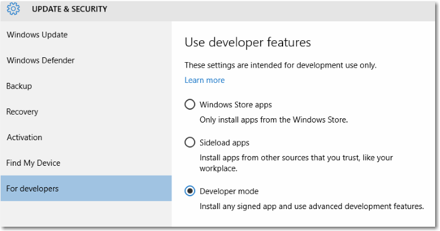

# Enable your device for development

There is a different approach for development for Windows 10 devices. A developer license is no longer required for each device that you want to use to develop, install or test your app. You just enable a device once for these tasks from the settings for the device. That's it. No more renewing your developer licenses every 30 or 90 days!

If you are still using a Windows 8.1 device to develop or test your apps with Microsoft Visual Studio 2013 or Microsoft Visual Studio 2015, you still need to [get a developer license](https://msdn.microsoft.com/library/windows/apps/Hh974578) or [register your Windows Phone](https://msdn.microsoft.com/library/windows/apps/Dn614128).

## Use developer features

### Develop your app with Microsoft Visual Studio

If you use Microsoft Visual Studio on a Windows 10 device and you open a solution for a Windows 8.1 or Windows 10 app, you are prompted to enable your device with this dialog. You need your device to be enabled to use the designers and debug your app.

When you see this dialog, click **settings for developers** to go directly to the **Update & security** page as shown below. Or click **OK** and then follow the steps below to enable your Windows 10 device for development.

### Enable your Windows 10 devices

For Windows 10, you choose the developer features you want to enable on the device. This includes any devices: Windows 10 desktops, tablets and phones. You can enable a device for development, or just for sideloading.

-   *Sideloading* is installing and then running or testing an app that has not been certified by the Windows Store. For example, an app that is internal to your company only.
-   *Developer mode* lets you sideload apps, and also run apps from Visual Studio in debug mode.

**Note**  If you sideload apps, you should still only install apps from trusted sources. When you install a sideloaded app that has not been certified by the Windows Store, you are agreeing that you have obtained all rights necessary to sideload the app and that you are solely responsible for any harm that results from installing and running the app. See the Windows &gt; Windows Store section of this [privacy statement](http://go.microsoft.com/fwlink/?LinkId=521839).

**To use developer features**

1.  On your device that you want to enable, go to **Settings**. Choose **Update & security**, then choose **For developers**.
2.  Choose the level of access that you need. For more detailed info about the options, see [Which settings should I choose: sideload apps or developer mode?](#WhichSettings)
3.  Read the disclaimer for the setting you chose, then click **Yes** to accept the change.

Here's the settings page on the desktop device family.

Here's the settings page on the mobile device family.

### Which settings should I choose: sideload apps or developer mode?

By default, you can only install Universal Windows Platform (UWP) apps from the Windows Store. Changing these settings to use developer features can change the level of security of your device. You should not install apps from unverified sources.

**Sideload apps**

The Sideload apps setting is typically used by companies or schools that need to install custom apps on managed devices without going through the Windows Store. In this case, it's common for the organization to enforce a policy that disables the *Windows Store apps* setting, as shown previously in the image of the phone settings page. The organization also provides the required certificate and install location to sideload apps. For more info, see the TechNet articles [Sideload apps in Windows 10](https://technet.microsoft.com/library/mt269549.aspx) and [Get started with app deployment in Microsoft Intune](https://technet.microsoft.com/library/dn646955.aspx).

Device family specific info

-   On the desktop device family: You can install an app package (.appx) and any certificate that is needed to run the app by running the Windows PowerShell script that is created with the package ("Add-AppDevPackage.ps1").

-   On the mobile device family: If the required certificate is already installed, you can tap the file to install any .appx sent to you via email or on an SD card.

**Sideload apps** is a more secure option than Developer mode because you cannot install apps on the device without a trusted certificate.

**Developer mode**

In addition to sideloading, the Developer mode setting enables debugging and additional deployment options. It replaces the Windows 8.1 requirement for a developer license.

Device family specific info

-   On the desktop device family:

    Enable Developer mode to develop and debug apps in Visual Studio. As stated previously, you will be prompted in Visual Studio if Developer mode is not enabled.

-   On the mobile device family:

    Enable developer mode to deploy apps from Visual Studio and debug them on the device.

    You can tap the file to install any .appx sent to you via email or on an SD card. Do not install apps from unverified sources.

**Tip**  
There are several tools you can use to deploy an app from a Windows 10 PC to a Windows 10 mobile device. Both devices must be connected to the same subnet of the network by a wired or wireless connection, or they must be connected by USB. Either of the ways listed installs only the app package (.appx); they do not install certificates.

-   Use the Windows 10 Application Deployment (WinAppDeployCmd) tool. Learn more about [the WinAppDeployCmd tool](http://msdn.microsoft.com/library/windows/apps/mt203806.aspx).
-   Starting in Windows 10, Version 1511, you can use [Device Portal](#device_portal) to deploy from your browser to a mobile device running Windows 10, Version 1511 or later. Use the **Apps** page in Device Portal (&lt;IP&gt;/appmanager.md) to upload an app package (.appx) and install it on the device.

 

### Set group policies or registry keys

You can also use group policies or registry keys as an alternative way to enable your Windows 10 desktop device for development.

**On the desktop device family**

Use gpedit.msc to set the group policies to enable your device, unless you have Windows 10 Home. If you do have Windows 10 Home, you need to use regedit or PowerShell commands to set the registry keys directly to enable your device.

**Use gpedit to enable your device**

1.  Run **Gpedit.msc**.
2.  Go to Local Computer Policy &gt; Computer Configuration &gt; Administrative Templates &gt; Windows Components &gt; App Package Deployment
3.  To enable sideloading, edit the policies to enable:

    -   **Allow all trusted apps to install**

    - OR -

    To enable developer mode, edit the policies to enable both:

    -   **Allow all trusted apps to install**
    -   **Allows development of Windows Store apps and installing them from an integrated development environment (IDE)**

4.  Reboot your machine.

**Use regedit to enable your device**

1.  Run **regedit**.
2.  To enable sideloading, set the value of this DWORD to 1:

    -   **HKLM\\SOFTWARE\\Microsoft\\Windows\\CurrentVersion\\AppModelUnlock\\AllowAllTrustedApps**

    - OR -

    To enable developer mode, set the values of this DWORD to 1:

    -   **HKLM\\SOFTWARE\\Microsoft\\Windows\\CurrentVersion\\AppModelUnlock\\AllowDevelopmentWithoutDevLicense**

**Use PowerShell to enable your device**

1.  Run PowerShell with administrator privileges.
2.  To enable sideloading, run this command:

    -   **PS C:\\WINDOWS\\system32&gt; reg add "HKEY\_LOCAL\_MACHINE\\SOFTWARE\\Microsoft\\Windows\\CurrentVersion\\AppModelUnlock" /t REG\_DWORD /f /v "AllowAllTrustedApps" /d "1"**

    - OR -

    To enable developer mode, run this command:

    -   **PS C:\\WINDOWS\\system32&gt; reg add "HKEY\_LOCAL\_MACHINE\\SOFTWARE\\Microsoft\\Windows\\CurrentVersion\\AppModelUnlock" /t REG\_DWORD /f /v "AllowDevelopmentWithoutDevLicense" /d "1"**

## Developer mode features

For each device family, additional developer features might be available. These features are available only when **Developer mode** is enabled on the device, and might vary depending on your OS version.

This image shows developer features for the mobile device family on Windows 10, Version 1511.

### Device discovery and Device Portal

To learn more about device discovery and Device Portal, see [Windows Device Portal overview](../debug-test-perf/device-portal.md).

For device specific setup instructions, see:
- [Device Portal for HoloLens](https://dev.windows.com/holographic/using_the_windows_device_portal)
- [Device Portal for IoT](http://ms-iot.github.io/content/en-US/win10/tools/DevicePortal.htm)
- [Device Portal for Mobile](../debug-test-perf/device-portal-mobile.md)
- [Device Portal for Xbox](../debug-test-perf/device-portal-xbox.md)

### Error reporting

Set this value to specify how many crash dumps are saved on your phone.

Collecting crash dumps on your phone gives you instant access to important crash information directly after the crash occurs. Dumps are collected for developer-signed apps only. You can find the dumps in your phone's storage in the Documents\\Debug folder. For more info about dump files, see [Using dump files](https://msdn.microsoft.com/library/d5zhxt22.aspx).

## Upgrading your device from Windows 8.1 to Windows 10

When you create or sideload apps on your Windows 8.1 device, you have to install a developer license. If you upgrade your device from Windows 8.1 to Windows 10, this information remains. Run the following command to remove this information from your upgraded Windows 10 device. This step is not required if you upgrade directly from Windows 8.1 to Windows 10, Version 1511 or later.

**To unregister a developer license**

1.  Run PowerShell with administrator privileges.
2.  Run this command: **unregister-windowsdeveloperlicense**.

After this you need to enable your device for development as described in this topic so that you can continue to develop on this device. If you don't do that, you might get an error when you debug your app, or you try to create a package for it. Here is an example of this error:

Error : DEP0700 : Registration of the app failed.

<!--HONumber=Jun16_HO3-->

