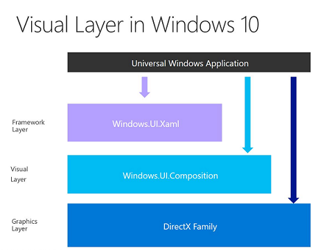

# Visual Layer

\[ Updated for UWP apps on Windows 10. For Windows 8.x articles, see the [archive](http://go.microsoft.com/fwlink/p/?linkid=619132) \]

In Windows 10, significant work was done to create a new unified compositor and rendering engine for all Windows applications, be it desktop or mobile. A result of that work was the unified Composition WinRT API called Windows.UI.Composition that offers access to new lightweight Composition objects along with new Compositor driven Animations and Effects.

Windows.UI.Composition is a declarative, [Retained-Mode](https://msdn.microsoft.com/library/windows/desktop/ff684178.aspx) API that can be called from any Universal Windows Platform (UWP) Application to create composition objects, animations and effects directly in an application. The API is a powerful supplement to existing frameworks such as XAML to give developers of UWP applications a familiar C# surface to add to their application. These APIs can be used to create DX style framework-less applications.

A XAML developer can “drop down” to the composition layer in C# to do custom work in the composition layer using WinRT to create a “Composition Island” of objects in their XAML application rather than dropping all the way down to the graphics layer and using DirectX and C++ for any custom UI work.

## Composition Objects and The Compositor

Composition objects are created by the [**Compositor**](https://msdn.microsoft.com/library/windows/apps/Dn706789) which acts as a factory for composition objects. The compositor can create [**Visual**](https://msdn.microsoft.com/library/windows/apps/Dn706858) objects, which allow for the creation of a visual tree structure on which all other features and Composition objects in the API use and build on.

The API allows developers to define and create one or many [**Visual**](https://msdn.microsoft.com/library/windows/apps/Dn706858) objects each representing a single node in a Visual tree.

Visuals can be containers for other Visuals or can host content Visuals. The API allows for ease of use by providing a clear set of [**Visual**](https://msdn.microsoft.com/library/windows/apps/Dn706858) objects for specific tasks that exist in a hierarchy:

-   [
              **Visual**
            ](https://msdn.microsoft.com/library/windows/apps/Dn706858) – The base object. The majority of the properties are here, and inherited by the other Visual objects.
-   [
              **ContainerVisual**
            ](https://msdn.microsoft.com/library/windows/apps/Dn706810) – Derives from [**Visual**](https://msdn.microsoft.com/library/windows/apps/Dn706858), and adds the ability to insert child visuals.
-   [
              **SpriteVisual**
            ](https://msdn.microsoft.com/library/windows/apps/Mt589433) – Derives from [**ContainerVisual**](https://msdn.microsoft.com/library/windows/apps/Dn706810), and contains content in the form of images, effects, and swapchains.
-   [
              **Compositor**
            ](https://msdn.microsoft.com/library/windows/apps/Dn706789) – The object factory that manages the relationship between an application and the system compositor process.

The compositor is also a factory for a number of other composition objects used to clip or transform visuals in the tree as well as a rich set of animations and effects.

## Effects System

Windows.UI.Composition supports real time effects that can be animated, customized and chained. Effects include 2D affine transforms, arithmetic composites, blends, color source, composite, contrast, exposure, grayscale, gamma transfer, hue rotate, invert, saturate, sepia, temperature and tint.

For more information, see the [Composition Effects](composition-effects.md) overview.

## Animation System

Windows.UI.Composition contains an expressive, framework agnostic animation system that allows you to set up two types of Animations: key frame animations and expression animations. These are used to move visual objects, drive a transform or a clip, or animate an effect. By running directly in the compositor process, this ensures smoothness and scale, letting you run large numbers of concurrent, unique animations.

For more information, see the [Composition animations](composition-animation.md) overview.

## XAML Interoperation

In addition to creating a visual tree from scratch, the Composition API can interoperate with an existing XAML UI using the [**ElementCompositionPreview**](https://msdn.microsoft.com/library/windows/apps/Mt608976) class in [**Windows.UI.Xaml.Hosting**](https://msdn.microsoft.com/library/windows/apps/Hh701908).

**Note**  
This article is for Windows 10 developers writing Universal Windows Platform (UWP) apps. If you’re developing for Windows 8.x or Windows Phone 8.x, see the [archived documentation](http://go.microsoft.com/fwlink/p/?linkid=619132).

 

## Additional Resources:

-   Read Kenny Kerr's MSDN Article on this API: [Graphics and Animation - Windows Composition Turns 10](https://msdn.microsoft.com/magazine/mt590968)
-   Composition samples in the [Composition GitHub](https://github.com/Microsoft/composition).
-   [
              **Full reference documentation for the API**
            ](https://msdn.microsoft.com/library/windows/apps/Dn706878).
-   Known issues: [Known Issues](https://social.msdn.microsoft.com/Forums/en-US/home?forum=Win10SDKToolsIssues).

 

 

<!--HONumber=Jun16_HO3-->

