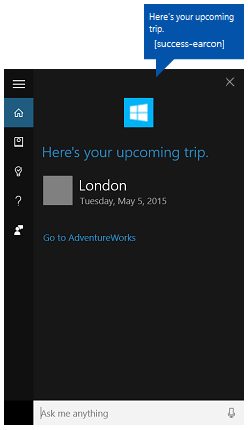
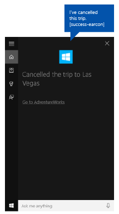

# Deep link from Cortana to a background app


**Important APIs**

-   [**Windows.ApplicationModel.VoiceCommands**](https://msdn.microsoft.com/library/windows/apps/dn706594)
-   [**Voice Command Definition (VCD) elements and attributes v1.2**](https://msdn.microsoft.com/library/windows/apps/dn706593)

Provide deep links from a background app in **Cortana** that launch the app to the foreground in a specific state or context.

> **Note**  
Both **Cortana** and the background app service are terminated when the foreground app is launched.

A deep link is displayed by default on the **Cortana** completion screen as shown here ("Go to AdventureWorks"), but you can display deep links on various other screens. 



**Prerequisites:  **

This topic builds on [Interact with a background app in Cortana](interact-with-a-background-app-in-cortana.md). We continue using a trip planning and management app named **Adventure Works** to demonstrate various **Cortana** features.

If you're new to developing Universal Windows Platform (UWP) apps, have a look through these topics to get familiar with the technologies discussed here.

-   [Create your first app](https://msdn.microsoft.com/library/windows/apps/bg124288)
-   Learn about events with [Events and routed events overview](https://msdn.microsoft.com/library/windows/apps/mt185584)

**User experience guidelines:  **

See [Cortana design guidelines](https://msdn.microsoft.com/library/windows/apps/dn974233) for info about how to integrate your app with **Cortana** and [Speech design guidelines](https://msdn.microsoft.com/library/windows/apps/dn596121) for helpful tips on designing a useful and engaging speech-enabled app.

## <span id="Overview"></span><span id="overview"></span><span id="OVERVIEW"></span>Overview


Users can access your app through **Cortana** by:

-   Activating it as a foreground app (see [Activate a foreground app with voice commands through Cortana](launch-a-foreground-app-with-voice-commands-in-cortana.md)).
-   Exposing specific functionality as a background app service (see [Activate a background app with voice commands through Cortana](launch-a-background-app-with-voice-commands-in-cortana.md)).
-   Deep linking to specific pages, content, and state or context.

We discuss deep linking here.

Deep linking is useful when Cortana and your app service act as a gateway to your full-featured app (instead of requiring the user to launch the app through the Start menu), or for providing access to richer detail and functionality within your app that is not possible through Cortana. Deep linking is another way to increase usability and promote your app.

There are three ways to provide deep links:

-   A "Go to &lt;app&gt;" link on various **Cortana** screens.
-   A link embedded in a content tile on various **Cortana** screens.
-   Programmatically launching the foreground app from the background app service.

## <span id="Go_to__app__deep_link"></span><span id="go_to__app__deep_link"></span><span id="GO_TO__APP__DEEP_LINK"></span>"Go to &lt;app&gt;" deep link


**Cortana** displays a "Go to &lt;app&gt;" deep link below the content card on most screens.



You can provide a launch argument for this link that opens your app in similar context as the app service. If you don't provide a launch argument, the app is launched to the main screen.

In this example from AdventureWorksVoiceCommandService.cs of the **AdventureWorks** sample, we pass the specified destination (`destination`) string to the SendCompletionMessageForDestination method, which retrieves all matching trips and provides a deep link to the app.

First, we create a  [**VoiceCommandUserMessage**](https://msdn.microsoft.com/library/windows/apps/windows.applicationmodel.voicecommands.voicecommandusermessage.aspx) (```userMessage```) that is spoken by **Cortana** and shown on the **Cortana** canvas. A [**VoiceCommandContentTile**](https://msdn.microsoft.com/library/windows/apps/windows.applicationmodel.voicecommands.voicecommandcontenttile.aspx) list object is then created for displaying the collection of result cards on the canvas. 

These two objects are then passed to the [CreateResponse](https://msdn.microsoft.com/library/windows/apps/windows.applicationmodel.voicecommands.voicecommandresponse.createresponse.aspx) method of the [**VoiceCommandResponse**](https://msdn.microsoft.com/library/windows/apps/dn974182) object (`response`). We then set the [**AppLaunchArgument**](https://msdn.microsoft.com/library/windows/apps/dn974183) property value of the response object to the value of `destination` passsed to this function. When a user taps a content tile on the Cortana canvas, the parameter values are passed to the app through the response object.

Finally, we call the [**ReportSuccessAsync**](https://msdn.microsoft.com/library/windows/apps/dn706580) method of the [**VoiceCommandServiceConnection**](https://msdn.microsoft.com/library/windows/apps/dn974204).

```csharp
/// <summary>
/// Show details for a single trip, if the trip can be found. 
/// This demonstrates a simple response flow in Cortana.
/// </summary>
/// <param name="destination">The destination specified in the voice command.</param>
private async Task SendCompletionMessageForDestination(string destination)
{
...
    IEnumerable<Model.Trip> trips = store.Trips.Where(p => p.Destination == destination);

    var userMessage = new VoiceCommandUserMessage();
    var destinationsContentTiles = new List<VoiceCommandContentTile>();
...
    var response = VoiceCommandResponse.CreateResponse(userMessage, destinationsContentTiles);

    if (trips.Count() > 0)
    {
        response.AppLaunchArgument = destination;
    }

    await voiceServiceConnection.ReportSuccessAsync(response);
}
```


## <span id="Content_tile_deep_link"></span><span id="content_tile_deep_link"></span><span id="CONTENT_TILE_DEEP_LINK"></span>Content tile deep link


You can add deep links to content cards on various **Cortana** screens.


Like the "Go to &lt;app&gt;" links, you can provide a launch argument to open your app with similar context as the app service. If you don't provide a launch argument, the content tile does not link to your app.

In this example from AdventureWorksVoiceCommandService.cs of the **AdventureWorks** sample, we pass the specified destination to the SendCompletionMessageForDestination method, which retrieves all matching trips and provides content cards with deep links to the app.

First, we create a  [**VoiceCommandUserMessage**](https://msdn.microsoft.com/library/windows/apps/windows.applicationmodel.voicecommands.voicecommandusermessage.aspx) (```userMessage```) that is spoken by **Cortana** and shown on the **Cortana** canvas. A [**VoiceCommandContentTile**](https://msdn.microsoft.com/library/windows/apps/windows.applicationmodel.voicecommands.voicecommandcontenttile.aspx) list object is then created for displaying the collection of result cards on the canvas. 

These two objects are then passed to the [CreateResponse](https://msdn.microsoft.com/library/windows/apps/windows.applicationmodel.voicecommands.voicecommandresponse.createresponse.aspx) method of the [**VoiceCommandResponse**](https://msdn.microsoft.com/library/windows/apps/dn974182) object (```response```). We then set the [**AppLaunchArgument**](https://msdn.microsoft.com/library/windows/apps/dn974183) property value to the value of the destination in the voice command.

Finally, we call the [**ReportSuccessAsync**](https://msdn.microsoft.com/library/windows/apps/dn706580) method of the [**VoiceCommandServiceConnection**](https://msdn.microsoft.com/library/windows/apps/dn974204).
Here, we add two content tiles with different [**AppLaunchArgument**](https://msdn.microsoft.com/library/windows/apps/dn974183) parameter values to a [**VoiceCommandContentTile**](https://msdn.microsoft.com/library/windows/apps/dn974168) list used in the [**ReportSuccessAsync**](https://msdn.microsoft.com/library/windows/apps/dn706580) call of the [**VoiceCommandServiceConnection**](https://msdn.microsoft.com/library/windows/apps/dn974204) object.

```csharp
/// <summary>
/// Show details for a single trip, if the trip can be found. 
/// This demonstrates a simple response flow in Cortana.
/// </summary>
/// <param name="destination">The destination specified in the voice command.</param>
private async Task SendCompletionMessageForDestination(string destination)
{
    // If this operation is expected to take longer than 0.5 seconds, the task must
    // supply a progress response to Cortana before starting the operation, and
    // updates must be provided at least every 5 seconds.
    string loadingTripToDestination = string.Format(
               cortanaResourceMap.GetValue("LoadingTripToDestination", cortanaContext).ValueAsString,
               destination);
    await ShowProgressScreen(loadingTripToDestination);
    Model.TripStore store = new Model.TripStore();
    await store.LoadTrips();

    // Query for the specified trip. 
    // The destination should be in the phrase list. However, there might be  
    // multiple trips to the destination. We pick the first.
    IEnumerable<Model.Trip> trips = store.Trips.Where(p => p.Destination == destination);

    var userMessage = new VoiceCommandUserMessage();
    var destinationsContentTiles = new List<VoiceCommandContentTile>();
    if (trips.Count() == 0)
    {
        string foundNoTripToDestination = string.Format(
               cortanaResourceMap.GetValue("FoundNoTripToDestination", cortanaContext).ValueAsString,
               destination);
        userMessage.DisplayMessage = foundNoTripToDestination;
        userMessage.SpokenMessage = foundNoTripToDestination;
    }
    else
    {
        // Set plural or singular title.
        string message = "";
        if (trips.Count() > 1)
        {
            message = cortanaResourceMap.GetValue("PluralUpcomingTrips", cortanaContext).ValueAsString;
        }
        else
        {
            message = cortanaResourceMap.GetValue("SingularUpcomingTrip", cortanaContext).ValueAsString;
        }
        userMessage.DisplayMessage = message;
        userMessage.SpokenMessage = message;

        // Define a tile for each destination.
        foreach (Model.Trip trip in trips)
        {
            int i = 1;
            
            var destinationTile = new VoiceCommandContentTile();

            destinationTile.ContentTileType = VoiceCommandContentTileType.TitleWith68x68IconAndText;
            destinationTile.Image = await StorageFile.GetFileFromApplicationUriAsync(new Uri("ms-appx:///AdventureWorks.VoiceCommands/Images/GreyTile.png"));

            destinationTile.AppLaunchArgument = trip.Destination;
            destinationTile.Title = trip.Destination;
            if (trip.StartDate != null)
            {
                destinationTile.TextLine1 = trip.StartDate.Value.ToString(dateFormatInfo.LongDatePattern);
            }
            else
            {
                destinationTile.TextLine1 = trip.Destination + " " + i;
            }

            destinationsContentTiles.Add(destinationTile);
            i++;
        }
    }

    var response = VoiceCommandResponse.CreateResponse(userMessage, destinationsContentTiles);

    if (trips.Count() > 0)
    {
        response.AppLaunchArgument = destination;
    }

    await voiceServiceConnection.ReportSuccessAsync(response);
}
```
## <span id="Programmatic_deep_link"></span><span id="programmatic_deep_link"></span><span id="PROGRAMMATIC_DEEP_LINK"></span>Programmatic deep link


You can also programmatically launch your app with a launch argument to open your app with similar context as the app service. If you don't provide a launch argument, the app is launched to the main screen.

Here, we add an [**AppLaunchArgument**](https://msdn.microsoft.com/library/windows/apps/dn974183) parameter with a value of "Las Vegas" to a [**VoiceCommandResponse**](https://msdn.microsoft.com/library/windows/apps/dn974182) object used in the [**RequestAppLaunchAsync**](https://msdn.microsoft.com/library/windows/apps/dn706581) call of the [**VoiceCommandServiceConnection**](https://msdn.microsoft.com/library/windows/apps/dn974204) object.

```CSharp
var userMessage = new VoiceCommandUserMessage();
userMessage.DisplayMessage = "Here are your trips.";
userMessage.SpokenMessage = 
  "You have one trip to Vegas coming up.";

response = VoiceCommandResponse.CreateResponse(userMessage);
response.AppLaunchArgument = “Las Vegas”;
await  VoiceCommandServiceConnection.RequestAppLaunchAsync(response);
```

## <span id="App_manifest"></span><span id="app_manifest"></span><span id="APP_MANIFEST"></span>App manifest


To enable deep linking to your app, you must declare the `windows.personalAssistantLaunch` extension in the Package.appxmanifest file of your app project.

Here, we declare the `windows.personalAssistantLaunch` extension for the **Adventure Works** app.

```XML
<Extensions>
  <uap:Extension Category="windows.appService" 
    EntryPoint="AdventureWorks.VoiceCommands.AdventureWorksVoiceCommandService">
    <uap:AppService Name="AdventureWorksVoiceCommandService"/>
  </uap:Extension>
  <uap:Extension Category="windows.personalAssistantLaunch"/> 
</Extensions>
```

## <span id="Protocol_contract"></span><span id="protocol_contract"></span><span id="PROTOCOL_CONTRACT"></span>Protocol contract


Your app is launched to the foreground through Uniform Resource Identifier (URI) activation using a [**Protocol**](https://msdn.microsoft.com/library/windows/apps/br224693) contract. Your app must override your app's [**OnActivated**](https://msdn.microsoft.com/library/windows/apps/br242330) event and check for an **ActivationKind** of **Protocol**. For more info, see [Handle URI activation](https://msdn.microsoft.com/library/windows/apps/mt228339).

Here, we decode the URI provided by the [**ProtocolActivatedEventArgs**](https://msdn.microsoft.com/library/windows/apps/br224742) to access the launch argument. For this example, the [**Uri**](https://msdn.microsoft.com/library/windows/apps/br224746) is set to "windows.personalassistantlaunch:?LaunchContext=Las Vegas".

```CSharp
if (args.Kind == ActivationKind.Protocol)
  {
    var commandArgs = args as ProtocolActivatedEventArgs;
    Windows.Foundation.WwwFormUrlDecoder decoder = 
      new Windows.Foundation.WwwFormUrlDecoder(commandArgs.Uri.Query);
    var destination = decoder.GetFirstValueByName("LaunchContext");

    navigationCommand = new ViewModel.TripVoiceCommand(
      "protocolLaunch",
      "text",
      "destination",
      destination);

    navigationToPageType = typeof(View.TripDetails);

    rootFrame.Navigate(navigationToPageType, navigationCommand);

    // Ensure the current window is active.
    Window.Current.Activate();
  }
```

## <span id="related_topics"></span>Related articles


**Developers**
* [Cortana interactions](cortana-interactions.md)
* [**VCD elements and attributes v1.2**](https://msdn.microsoft.com/library/windows/apps/dn706593)

**Designers**
* [Cortana design guidelines](https://msdn.microsoft.com/library/windows/apps/dn974233)
* [Speech design guidelines](https://msdn.microsoft.com/library/windows/apps/dn596121)

**Samples**
* [Cortana voice command sample](http://go.microsoft.com/fwlink/p/?LinkID=619899)
 

 


<!--HONumber=Jun16_HO2-->


