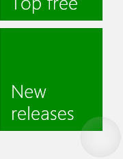
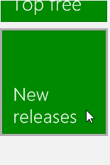
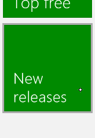
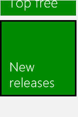
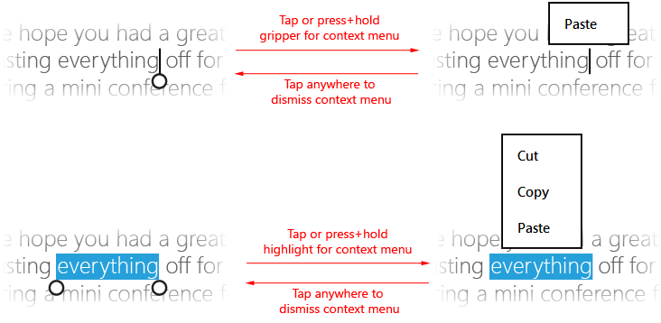
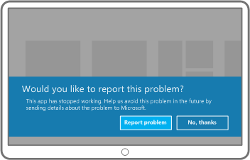

# Guidelines for visual feedback

Use visual feedback to show users when their interactions are detected, interpreted, and handled. Visual feedback can help users by encouraging interaction. It indicates the success of an interaction, which improves the user's sense of control. It also relays system status and reduces errors.

**Important APIs**

-   [**Windows.Devices.Input**](https://msdn.microsoft.com/library/windows/apps/br225648)
-   [**Windows.UI.Input**](https://msdn.microsoft.com/library/windows/apps/br242084)
-   [**Windows.UI.Core**](https://msdn.microsoft.com/library/windows/apps/br208383)

## Dos and don'ts

-   Provide visual feedback no matter how brief the contact. This helps the user to:
    -   Confirm that the touch screen is working.
    -   Identify whether the target is touch-enabled or responsive.
    -   Identify whether the user missed their intended target.
-   Display feedback immediately for all interaction events.
-   Provide feedback that consists of subtle, intuitive cues that don't distract users.
-   Ensure touch targets stick to the fingertip during all manipulations.
-   Enable selection of items with the swipe gesture when panning is constrained to one direction.
-   Don't use touch visualizations in situations where they might interfere with the use of the app. For more info, see [**ShowGestureFeedback**](https://msdn.microsoft.com/library/windows/apps/br241969).
-   Don't display feedback unless it is absolutely necessary. Keep the UI clean and uncluttered by not showing visual feedback unless you are adding value that is not available elsewhere. Never display tooltips if they repeat text that is already visible. Tooltips should be reserved for specific occasions, such as truncated text (text with ellipsis) that is not displayed when the item is selected, or where additional information is required to understand or use your app.
-   Don't use the press and hold gesture for anything other than informational UI.  
    **Important**  Press and hold can be used for selection in cases where both horizontal and vertical panning is enabled.    
-   Don't customize the visual feedback behaviors of the built-in Windows 8 gestures, as this can create an inconsistent and confusing user experience.
-   Don't show visual feedback during panning or dragging; the actual movement of the object on the screen is sufficient. But if the content area doesn't pan or scroll, then use visualizations to indicate the boundary conditions. For more info, see [Guidelines for panning](guidelines-for-panning.md).
-   Don't display feedback for a control that isn't identified as the target. Visual feedback is critical when relying on touch input for activities that require accuracy and precision based on location. Displaying feedback every time you detect touch input helps the user understand any custom targeting heuristics defined by your app and its controls.
-   Don't use feedback behavior intended for one input type with another. For example, a keyboard focus rectangle should be used only with keyboard input, not touch.

## Additional usage guidance

Contact visualizations are especially critical for touch interactions that require accuracy and precision. For example, your app should clearly indicate the location of a tap to let a user know if they missed their target, how much they missed it by, and what adjustments they must make.

Use the platform controls exposed through the Windows Store apps language frameworks (Windows Store apps using JavaScript and Windows Store apps using C++, C\#, or Visual Basic) to get Windows 8 visualizations for free. If your app features custom interactions that require customized feedback, you should ensure the feedback is appropriate, spans input devices, and doesn't distract a user from their task. This can be a particular issue in game or drawing apps, where the visual feedback might conflict with or obscure critical UI.

[!IMPORTANT] We don't recommend changing the interaction behavior of the built-in gestures. 

### Feedback UI

Feedback UI is generally dependent on the input device (touch, touchpad, mouse, pen/stylus, keyboard, and so on). For example, the built-in feedback for a mouse usually involves moving and changing the cursor, while touch and pen require contact visualizations, and keyboard input and navigation uses focus rectangles and highlighting.

Use [**ShowGestureFeedback**](https://msdn.microsoft.com/library/windows/apps/br241969) to set feedback behavior for the platform gestures.

If customizing feedback UI, ensure you provide feedback that supports, and is suitable for, all input modes.

Here are some examples of built-in contact visualizations in Windows.

|  |  |  |  | 
| --- | --- | --- | --- |
| Touch visualization | Mouse/touchpad visualization | Pen visualization | Keyboard visualization |

### Informational UI (popups)

One of the primary forms of visual feedback is informational UI (or disambiguation UI). Informational UI identifies and displays info about an object, describes functionality and how to access it, and provides guidance where necessary.

Here are the different types of informational UI supported by Windows Store apps.

-   Tooltips
-   Rich tooltips
-   Menus
-   Message dialogs
-   Flyouts

Informational UI is particularly useful for overcoming fingertip occlusion (obstruction) and improving touch interactions with your app. It even has a built-in gesture dedicated to it: press and hold.

Press and hold is a timed interaction, which are typically discouraged in Windows 8. A timed interaction is acceptable in this case as it is used as a tool for learning and exploration. The recommended length of time depends on the type of informational UI. Here are the recommended time thresholds.

| Informational UI type | Timing | Activation | Usage |
| --- | --- | --- | --- |
| Occlusion tooltip (for scrubbing and small targets) | 0 ms | Yes | For rapid clarification of actions. Typically used for commands. |
| Occlusion tooltip (for actions) | 200 ms | Yes | |
| Rich tooltip | ~2000 ms | No | For slower, more deliberate exploration and learning. Typically used with collection items. |
| Self-revealing interaction | ~2000 ms | No | |
| Context menu | ~2000 ms | No | Exposes a limited set of commands related to the selected object. |
| Flyouts | ~2000 ms | No | Exposes a limited set of commands related to the selected object. |

For more info on providing informational UI, see [Laying out your UI](https://msdn.microsoft.com/library/windows/apps/hh465304) and [Displaying popups](https://msdn.microsoft.com/library/windows/apps/hh738362).

### Tooltips

Use tooltips to reveal more information about a control before asking the user to perform an action.

Tooltips ([**Tooltip**](https://msdn.microsoft.com/library/windows/apps/br229763)) appear automatically when a user performs a press and hold gesture (or a hover event is detected) on a control or object. The tooltip disappears when the contact or cursor moves off the control or object. A tooltip can include text and images, but is not interactive.

### Occlusion tooltips for small targets

Occlusion tooltips describe the occluded target. These tooltips are useful when targeting and activating items smaller than a standard touch target size, such as hyperlinks on a webpage.

You can replace these tooltips with an informational pop-up after a certain time threshold has passed. For example, use an occlusion tooltip to show the occluded text of the hyperlink and then replace the tooltip with a pop-up containing the URL.

### Occlusion tooltips for actions and commands

These tooltips describe the action or command that occurs when a user lifts their finger from an element. These tooltips are useful when targeting and activating a button or similar control.

A small-target tooltip can be followed by an action tooltip after a certain time threshold has passed. In this case, the small-target tooltip should expand to include the additional info in the action tooltip.

### Rich tooltip

These tooltips reveal secondary info about an element. For example, a rich tooltip could be a text description of an image, the full text of a truncated title, or other info relevant to the target.

Rich tooltips typically contain info that doesn't need to be made available immediately and, in some cases, might be distracting if shown too quickly. A longer time threshold lets users be more deliberate about obtaining the info.

After a rich tooltip is displayed, the object is no longer activated when the user lifts their finger. The reason for this is that info gleaned from the tooltip might influence the user to not to activate the item.

We recommend that the visual design and info in the rich tooltip be distinct and more substantial than that of a standard tooltip.

### Context menu

The context menu ([**PopupMenu**](https://msdn.microsoft.com/library/windows/apps/br208693)) is a lightweight menu that gives users immediate access to actions (like clipboard commands) on text or UI objects in Windows Store apps.

The touch-optimized context menu consists of two parts. A visual cue, the hint, is displayed as a result of a hold interaction. Then, the context menu itself is displayed after the hint disappears and the user lifts their finger.

The following images demonstrate how to invoke the default context menu for text by tapping within a selection or on a gripper (press and hold can also be used).

See [Adding context menus](https://msdn.microsoft.com/library/windows/apps/hh465300).

### Message dialog

Use message dialogs ([**MessageDialog**](https://msdn.microsoft.com/library/windows/apps/br208674)) to prompt users for a response, based on user action or app state, before continuing. Explicit user interaction is required and input to the app is blocked until the user responds.

Here are some typical reasons to display a message dialog.

-   Present urgent information
-   Ask a question before continuing execution
-   Display error messages

See [Adding message dialogs](https://msdn.microsoft.com/library/windows/apps/hh738361).

### Flyout

A flyout ([**Flyout**](https://msdn.microsoft.com/library/windows/apps/br211726)) is a lightweight UI panel displayed on a tap, click, or other activation that is used to present the user with information, questions, or a menu of options related to the current activity. It can be light dismissed (it disappears when the user touches or clicks outside the flyout panel or presses ESC). In other words, a flyout can be ignored.

Unlike tooltips, flyouts can accept input. Unlike message dialogs, the app is still active and accepting input.

See [Adding Flyouts and menus](https://msdn.microsoft.com/library/windows/apps/hh465325).

## Related articles

**For designers**
* [Guidelines for panning](guidelines-for-panning.md)

**For developers**
* [Custom user interactions](https://msdn.microsoft.com/library/windows/apps/mt185599)

**Samples**
* [Basic input sample](http://go.microsoft.com/fwlink/p/?LinkID=620302)
* [Low latency input sample](http://go.microsoft.com/fwlink/p/?LinkID=620304)
* [User interaction mode sample](http://go.microsoft.com/fwlink/p/?LinkID=619894)
* [Focus visuals sample](http://go.microsoft.com/fwlink/p/?LinkID=619895)

**Archive samples**
* [Input: XAML user input events sample](http://go.microsoft.com/fwlink/p/?linkid=226855)
* [Input: Device capabilities sample](http://go.microsoft.com/fwlink/p/?linkid=231530)
* [Input: Touch hit testing sample](http://go.microsoft.com/fwlink/p/?linkid=231590)
* [XAML scrolling, panning, and zooming sample](http://go.microsoft.com/fwlink/p/?linkid=251717)
* [Input: Simplified ink sample](http://go.microsoft.com/fwlink/p/?linkid=246570)
* [Input: Windows 8 gestures sample](http://go.microsoft.com/fwlink/p/?LinkId=264995)
* [Input: Manipulations and gestures (C++) sample](http://go.microsoft.com/fwlink/p/?linkid=231605)
* [DirectX touch input sample](http://go.microsoft.com/fwlink/p/?LinkID=231627)
 

 

<!--HONumber=Jun16_HO2-->

