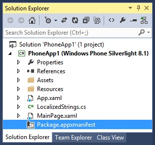

# AdControl in Windows Phone Silverlight


\[ Updated for UWP apps on Windows 10. For Windows 8.x articles, see the [archive](http://go.microsoft.com/fwlink/p/?linkid=619132) \]

This walkthrough shows how to use the [AdControl](https://msdn.microsoft.com/library/windows/apps/hh524191.aspx) class to display banner ads in a Silverlight app for Windows Phone 8.1 or Windows Phone 8.0.

## Prerequisites

*  Install the [Microsoft Store Engagement and Monetization SDK](http://aka.ms/store-em-sdk) with Visual Studio 2015 or Visual Studio 2013.


## Add the advertising assembly references

The Microsoft Advertising assemblies for Windows Phone Silverlight projects are not installed locally with the Microsoft Store Engagement and Monetization SDK. Before you can get started updating your code, you must first use **Connected Services** with the ad mediation support in the Microsoft Store Engagement and Monetization SDK to download these assemblies and reference them in your project.

1.  In Visual Studio, click **Project** and **Add Connected Service**.

2.  In the **Add Connected Service** dialog, click **Ad Mediator** and then click **Configure**.

3.  Click **Select ad networks**, select **Microsoft Advertising** only.

    At this point, all the necessary Microsoft advertising assemblies for Silverlight are downloaded to your local project via NuGet packages, and references to these assemblies are automatically added to your project. A reference to the ad mediation assembly is also added to your project. You will remove the ad mediation assembly reference in a later step, because it is not necessary for this scenario.

4.  In the **Select ad networks** dialog, click **OK**. Click **OK** again in the following **Fetching status** confirmation page, and finally click **Add** to close the **Ad Mediator** dialog.

5.  In **Solution Explorer**, expand the **References** node. Right-click **Microsoft.AdMediator.WindowsPhone81SL.MicrosoftAdvertising** and click **Remove**. This assembly reference is not necessary for this scenario.

## Code your app


1.  Add the following capabilities to the in the **Capabilities** node in your WMAppManifest.xml file.

    ``` syntax
    <Capability Name="ID_CAP_IDENTITY_USER"/>
    <Capability Name="ID_CAP_MEDIALIB_PHOTO"/>
    <Capability Name="ID_CAP_PHONEDIALER"/>
    ```

    For this example, your **Capabilities** node looks like:

    ``` syntax
        <Capabilities>
          <Capability Name="ID_CAP_NETWORKING"/>
          <Capability Name="ID_CAP_MEDIALIB_AUDIO"/>
          <Capability Name="ID_CAP_MEDIALIB_PLAYBACK"/>
          <Capability Name="ID_CAP_SENSORS"/>
          <Capability Name="ID_CAP_WEBBROWSERCOMPONENT"/>
          <Capability Name="ID_CAP_IDENTITY_USER"/>
          <Capability Name="ID_CAP_MEDIALIB_PHOTO"/>
          <Capability Name="ID_CAP_PHONEDIALER"/>
        </Capabilities>
    ```

2.  (Optional) Save your project. Click on the **Save All** icon or under the **File** menu click **Save All**.

3.  Add the **Internet (Client & Server)** capability to the Package.appxmanifest file in your project. In **Solution Explorer**, double click **Package.appxmanifest**.

    

    In the **Editor**, click the **Capabilities** tab. Check the **Internet (Client & Server)** box.

4.  (Optional) Save your project. Click on the **Save All** icon or under the **File** menu click **Save All**.

5.  Modify the Silverlight markup in the MainPage.xaml file to include the **Microsoft.Advertising.Mobile.UI** namespace.

    ``` syntax
    xmlns:UI="clr-namespace:Microsoft.Advertising.Mobile.UI;assembly=Microsoft.Advertising.Mobile.UI"
    ```

    The header of your page will have the following code:

    ``` syntax
        xmlns:mc="http://schemas.openxmlformats.org/markup-compatibility/2006"
        xmlns:UI="clr-namespace:Microsoft.Advertising.Mobile.UI;assembly=Microsoft.Advertising.Mobile.UI"
        x:Class="PhoneApp1.MainPage"
    ```

6.  In the **Grid** tag, add the following code for the **AdControl**. Assign the **ApplicationId** and **AdUnitId** properties to the test values provided in [Test mode values](test-mode-values.md), and adjust the **Height** and **Width** properties to one of the [supported ad sizes for banner ads](supported-ad-sizes-for-banner-ads.md).

    > **Note**  
    You will replace the test **ApplicationId** and **AdUnitId** values with live values before submitting your app for submission.

    ``` syntax
    <Grid x:Name="ContentPanel" Grid.Row="1">

      <UI:AdControl
             ApplicationId="3f83fe91-d6be-434d-a0ae-7351c5a997f1"
             AdUnitId="10865270"
             HorizontalAlignment="Left"
             Height="80"
             VerticalAlignment="Top"
             Width="480"/>

    </Grid>
    ```

7.  Build and run your project. Confirm that your app displays an ad, similar to the following:

    

## Release your app with live ads using Dev Center


1.  In the Dev Center dashboard, go to the **Monetization**&gt;**Monetize with ads** page for your app, and [create a standalone Microsoft Advertising unit](../publish/monetize-with-ads.md). For the ad unit type, specify **Banner**. Make note of both the ad unit ID and the application ID.

2.  In your code, replace the test ad unit values (**applicationId** and **adUnitId**) with the live values you generated in Dev Center.

3.  [Submit your app](../publish/app-submissions.md) to the Store using the Dev Center dashboard.

4.  Review your [advertising performance reports](../publish/advertising-performance-report.md) in the Dev Center dashboard.


 


<!--HONumber=Jun16_HO3-->


