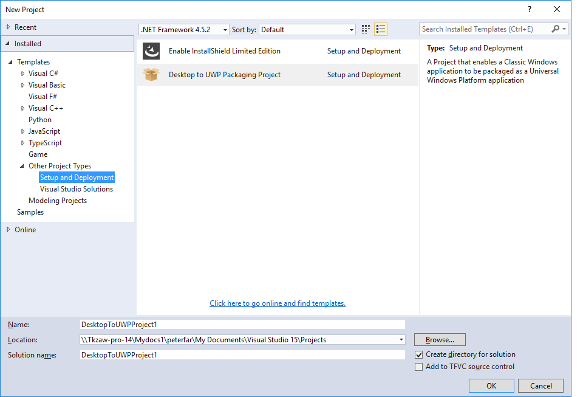
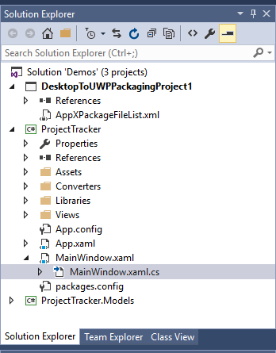
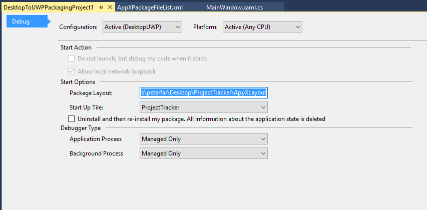
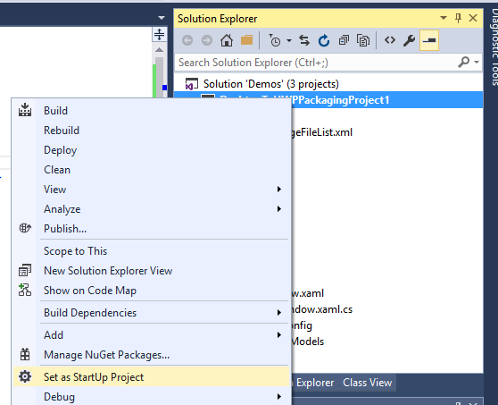
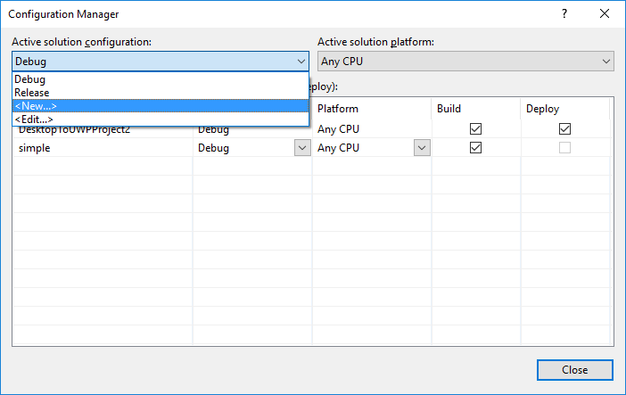
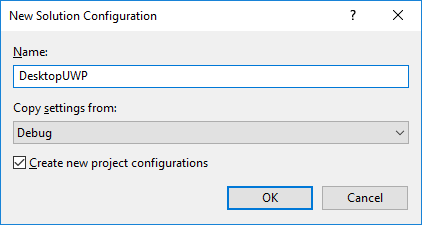

# Deploy and debug your converted UWP app (Project Centennial)

\[Some information relates to pre-released product which may be substantially modified before it's commercially released. Microsoft makes no warranties, express or implied, with respect to the information provided here.\]

This topic contains info to help you be successful deploying and debugging your app after converting it. Also, if you're curious about some of the internals of the Desktop Conversion extensions, then this topic is for you.

## Debug your converted UWP app

You have two main options for debugging your converted app using Visual Studio.

### Attach to process

When Microsoft Visual Studio is running "as administrator", the __Start Debugging__ and __Start Without Debugging__ commands will work for a converted app's project, but the launched app will run with [medium integrity level](https://msdn.microsoft.com/library/bb625963). That is, it will _not_ have elevated privileges. To confer administrator privileges onto the launched app, first you need to launch the "as administrator" via a shortcut or a tile. Once the app is running, from an instance of Microsoft Visual Studio running "as administrator", invoke the __Attach to Process__ and select your app's process from the dialog.

### F5 debug

Visual Studio now supports a new packaging project that enables you to automatically copy any updates you make when you build your application into the AppX package created when you ran the converter on your application’s installer. Once you configure the packaging projectyou can now also use F5 to debug directly into the AppX package. 

Here's how to get started: 

1. First, ensure you're set up to use Centennial. For instructions, see [Desktop App Converter Preview (Project Centennial)](https://msdn.microsoft.com/windows/uwp/porting/desktop-to-uwp-run-desktop-app-converter). 

2. Run the converter and then installer for your Win32 application. The converter captures the layout, and any changes made to the registry and outputs an Appx with manifest and registery.dat to virtualize the registry:


3. Install and launch [Visual Studio "15" Preview 2](https://www.visualstudio.com/downloads/visual-studio-next-downloads-vs.aspx). 

4. Install the Desktop to UWP Packaging VSIX project from the [Visual Studio Gallery](http://go.microsoft.com/fwlink/?LinkId=797871). 

5. Open the corresponding Win32 solution that was converted in Visual Studio.
 
6. Add the new packaging project to your solution by right clicking on the solution and choosing "Add New Project". Then pick the Desktop to UWP Packaging Project under Setup and Deployment:

    

    The resulting project will be added to your solution:

    

    In the Packaging project, the AppXFileList provides a mapping of files into the AppX layout. References begins empty, but should be manually set to the .exe project for build ordering. 

7. The DesktopToUWPPackaging project has a property page which allows you to configure the AppX package root and which tile to execute:

    

    Set the PackageLayout to the root location of the AppX that was created by the converter (above). Then pick which tile to execute.

8.  Open and edit the AppXFileList.xml. This file defines how to copy the output of the Win32 debug build into the AppX layout  the converter built. By default, we have a placeholder in the file with an example tag and comment:

    ```XML
    <?xml version="1.0" encoding="utf-8"?>
    <Project ToolsVersion="4.0" xmlns="http://schemas.microsoft.com/developer/msbuild/2003">
      <ItemGroup>
    <!— Use the following syntax to copy debug output to the AppX layout
       <AppxPackagedFile Include="$(outdir)\App.exe">
          <PackagePath>App.exe</PackagePath>
        </AppxPackagedFile> 
        See http://etc...
    -->
      </ItemGroup>
    </Project>
    ```

    Below is an example of creating the mapping. In this case, we copy the .exe and .dll from the Win32 build location into the package layout location. 

    ```XML
    <?xml version="1.0" encoding=utf-8"?>
    <Project ToolsVersion=14.0" xmlns="http://scehmas.microsoft.com/developer/msbuild/2003">
        <PropertyGroup>
            <MyProjectOutputPath>C:\{path}</MyProjectOutputPath>
        </PropertyGroup>
        <ItemGroup>
            <LayoutFile Include="$(MyProjectOutputPath)\ProjectTracker.exe">
                <PackagePath>$(PackageLayout)\VFS\Program Files (x86)\Contoso Software\Project Tracker\ProjectTracker.exe</PackagePath>
            </LayoutFile>
            <LayoutFile Include="$(MyProjectOutputPath)\ProjectTracker.Models.dll">
                <PackagePath>$(PackageLayout)\VFS\Program Files (x86)\Contoso Software\Project Tracker\ProjectTracker.Models.dll</PackagePath>
            </LayoutFile>
        </ItemGroup>
    </Project>
    ```

    The file is defined as follows: 

    First, we define *MyProjectOutputPath* to point at the location where the Win32 project is building to:

    ```XML
    <?xml version="1.0" encoding="utf-8"?>
    <Project ToolsVersion="14.0" xmlns="http://schemas.microsoft.com/developer/msbuild/2003">
        <PropertyGroup>
            <MyProjectOutputPath>C:\Users\peterfar\Desktop\ProjectTracker\ProjectTracker\bin\DesktopUWP</MyProjectOutputPath>
        </PropertyGroup>
    ```

    Then, each *LayoutFile* specifies a file to copy from the Win32 build location to the Appx Package layout. In this case first a .exe, then a .dll are copied. 

    ```XML
        <ItemGroup>
            <LayoutFile Include="$(MyProjectOutputPath)\ProjectTracker.exe">
                <PackagePath>$(PackageLayout)\VFS\Program Files (x86)\Contoso Software\Project Tracker\ProjectTracker.exe</PackagePath>
            </LayoutFile>
            <LayoutFile Include="$(MyProjectOutputPath)\ProjectTracker.Models.dll">
                <PackagePath>$(PackageLayout)\VFS\Program Files (x86)\Contoso Software\Project Tracker\ProjectTracker.Models.dll</PackagePath>
            </LayoutFile>
        </ItemGroup>
    </Project>
    ```

9. Set the packaging project the start-up project. This will copy the Win32 files into the AppX and then launch the debugger when the project is built and run.  

    

10. Finally, you can now set a breakpoint in the Win32 code and hit F5 to launch the debugger. It will copy any updates you have made to your Win32 application across to the AppX package and allow you to debug directly from within Visual Studio.

11. If you update your application, you'll need to use MakeAppX to repackage your app again. For more information, see [App packager (MakeAppx.exe)](https://msdn.microsoft.com/en-us/library/windows/desktop/hh446767(v=vs.85).aspx). 

If you have multiple build configurations (for instance for release and debug), you can add the following to the AppXFileList.xml file to copy the Win32 build from different locations:

```XML
<PropertyGroup>
    <MyProjectOutputPath Condition="$(Configuration) == 'DesktopUWP'">C:\Users\peterfar\Desktop\ProjectTracker\ProjectTracker\bin\DesktopUWP>
    </MyProjectOutputPath>
    <MyProjectOutputPath Condition="$(Configuration) == 'ReleaseDesktopUWP'"> C:\Users\peterfar\Desktop\ProjectTracker\ProjectTracker\bin\ReleaseDesktopUWP</MyProjectOutputPath>
</PropertyGroup>
```

You can also use conditional compilation to enable particular code paths if you update your application to UWP but also still want to build it for Win32. 

1.  In the example below the code will only be compiled for DesktopUWP and will show a tile using the WinRT API. 

    ```C#
    [Conditional("DesktopUWP")]
    private void showtile()
    {
        XmlDocument tileXml = TileUpdateManager.GetTemplateContent(TileTemplateType.TileSquare150x150Text01);
        XmlNodeList textNodes = tileXml.GetElementsByTagName("text");
        textNodes[0].InnerText = string.Format("Welcome to DesktopUWP!");
        TileNotification tileNotification = new TileNotification(tileXml);
        TileUpdateManager.CreateTileUpdaterForApplication().Update(tileNotification);
    }
    ```

2.  You can use Configuration Manager to add the new build configuration:

    

    

3.  Then under the project properties add support for conditional compilation symbols:

    

4.  You can now toggle the build target to DesktopUWP if you want to build to target the UWP API you added.

## Deploy your converted UWP app

To deploy your app during development, run the following PowerShell cmdlet: 

```Add-AppxPackage –Register AppxManifest.xml```

To update your app's .exe or .dll files, simply replace the existing files in your package with the new ones, increase the version number in AppxManifest.xml, and then run the above command again.

Note the following: 

Any drive that you install your converted app on to must be formatted to NTFS format.

A converted app always runs as the interactive user. This has particular significance for a .NET app whose manifest specifies an execution level of __requireAdministrator__. If the interactive user has administrator privileges then a UAC prompt will be displayed _each time the app is launched_. For standard users, the app will fail to launch.

If you try to run the Add-AppxPackage cmdlet on a machine where you haven't imported the cert you created, you'll get an error.

Before you deploy your app, you'll need to sign it with a certificate. For information on creating a certificate, see [Sign your .Appx Package](https://msdn.microsoft.com/windows/uwp/porting/desktop-to-uwp-run-desktop-app-converter#deploy-your-converted-appx). 

Here's how you import a certificate that you created previously. You can install it directly, or you can install it from an appx that you've signed, like the customer will.
1.  In File Explorer, right click an appx that you've signed with a test cert and choose **Properties** from the context menu.
2.  Click or tap the **Digital Signatures** tab.
3.  Click or tap on the certificate and choose **Details**.
4.  Click or tap **View Certificate**.
5.  Click or tap **Install Certificate**.
6.  In the **Store Location** group, select **Local Machine**.
7.  Click or tap **Next** and **OK** to confirm the UAC dialog.
8.  In the next screen of the Certificate Import Wizard, change the selected option to **Place all certificates in the following store**.
9.  Click or tap **Browse**. In the Select Certificate Store window, scroll down and select **Trusted People** and click or tap **OK**.
10. Click or tap **Next**. A new screen appears. Click or tap **Finish**.
11. A confirmation dialog should appear. If so, click **OK**. If a different dialog indicates that there is a problem with the certificate, you may need to do some certificate troubleshooting.

For Windows to trust the certificate, the certificate must be located in either the **Certificates (Local Computer) > Trusted Root Certification Authorities > Certificates** node or the **Certificates (Local Computer) > Trusted People > Certificates** node. Only certificates in these two locations can validate the certificate trust in the context of the local machine. Otherwise, an error message that resembles the following string appears:
```CMD
"Add-AppxPackage : Deployment failed with HRESULT: 0x800B0109, A certificate chain processed,
but terminated in a rootcertificate which is not trusted by the trust provider.
(Exception from HRESULT: 0x800B0109) error 0x800B0109: The root certificate of the signature
in the app package must be trusted."
```

### Behind the scenes

When you run your converted app, your UWP app package is launched from \Program Files\WindowsApps\\&lt;_package name_&gt;\\&lt;_appname_&gt;.exe. If you look there, you'll see that your app has an app package manifest (named AppxManifest.xml), which references a special xml namespace that's used for converted apps. Inside that manifest file is an __&lt;EntryPoint&gt;__ element, which references a full-trust app. When that app is launched, it does not run inside an app container, but instead it runs as the user as it normally would.

But the app runs in a special environment where any accesses that the app makes to the file system and to the Registry are redirected. The file named Registry.dat is used for Registry redirection. It's actually a Registry hive, so you can view it in the Windows Registry Editor (Regedit). Note, that this mechanism means that you can't use the Registry for inter-process communication. The Registry wasn't designed for, and is not well-suited to, that practice in any case. When it comes to the file system, the only thing redirected is the AppData folder, and it is redirected to the same location that app data is stored for all UWP apps. This location is known as the local app data store, and you access it by using the [ApplicationData.LocalFolder](https://msdn.microsoft.com/library/windows/apps/br241621) property. This way, your code is already ported to read and write app data in the correct place without you doing anything. And you can also write there directly. One benefit of file system redirection is a cleaner uninstall experience.

Inside a folder named VFS, you will see folders that contain the DLLs that your app has dependencies on. These DLLs are installed into system folders for the classic desktop version of your app. But, as a UWP app, the DLLs are local to your app. This way, there are no versioning problems when UWP apps are installed and uninstalled.

## See also
[Convert your desktop application to a Universal Windows Platform (UWP) app](https://msdn.microsoft.com/windows/uwp/porting/desktop-to-uwp-root)

[Desktop App Converter Preview (Project Centennial)](https://msdn.microsoft.com/windows/uwp/porting/desktop-to-uwp-run-desktop-app-converter)

[Manually convert your Windows desktop application to a Universal Windows Platform (UWP) app](https://msdn.microsoft.com/en-us/windows/uwp/porting/desktop-to-uwp-manual-conversion)

[Desktop app bridge to UWP code samples on GitHub](https://github.com/Microsoft/DesktopBridgeToUWP-Samples)

<!--HONumber=Jun16_HO3-->


