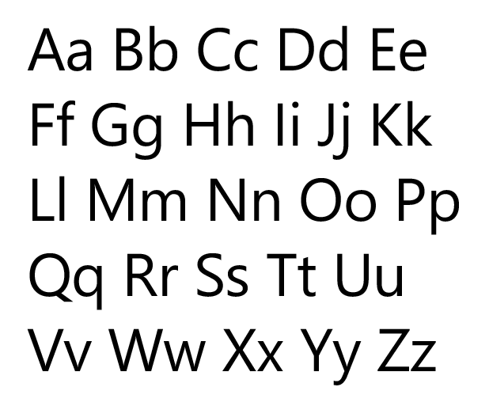
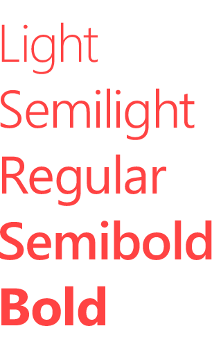
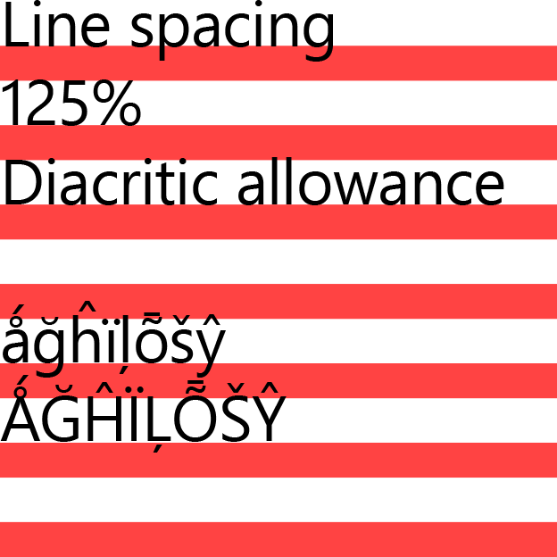
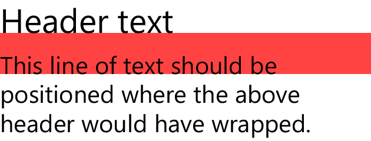
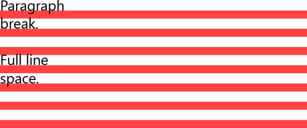
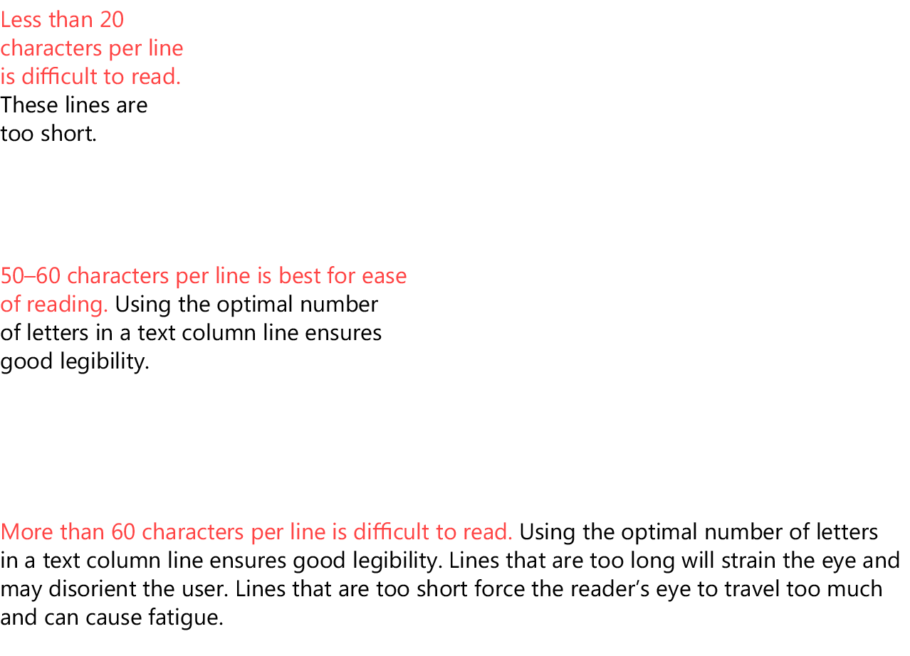
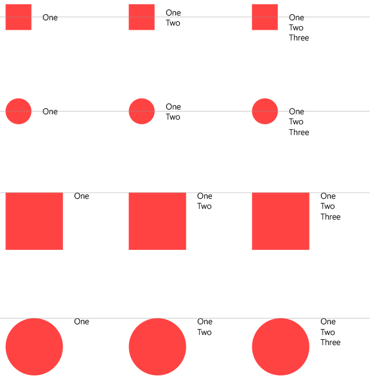

# Typography for UWP apps

As the visual representation of language, typography’s main task is to be clear. Its style should never get in the way of that goal. But typography also has an important role as a layout component—with a powerful effect on the density and complexity of the design—and on the user’s experience of that design.

## Typeface

We’ve selected Segoe UI for use on all Microsoft digital designs. Segoe UI provides a wide range of characters and is designed to maintain optimal legibility across sizes and pixel densities. It offers a clean, light, and open aesthetic that complements the content of the system.



## Weights

We approach typography with an eye to simplicity and efficiency. We choose to use one typeface, a minimum of weights and sizes, and a clear hierarchy. Positioning and alignment follow the default style for the given language. In English the sequence runs left to right, top to bottom. Relationships between text and images are clear and straightforward.



## Line spacing



Line spacing should be calculated at 125% of the font size, rounding to the closest multiple of four when necessary. For example with 15px Segoe UI, 125% of 15px is 18.75px. We recommend rounding up and setting line height to 20px to stay on the 4px grid. This ensures a good reading experience and adequate space for diacritical marks. See the Type ramp section below for specific examples.

When stacking larger type on top of smaller type, the distance from the last baseline of the larger type to the first baseline of the smaller type should be equal to the larger type's line height.



In XAML, this is accomplished by stacking two [TextBlocks](https://msdn.microsoft.com/en-us/library/windows/apps/windows.ui.xaml.controls.textblock.aspx) and setting the appropriate margin.

```xaml
<StackPanel Width="200">
    <!-- Setting a bottom margin of 3px on the header
         puts the baseline of the body text exactly 24px
         below the baseline of the header. 24px is the
         recommended line height for a 20px font size,
         which is what's set in SubtitleTextBlockStyle.
         The bottom margin will be different for
         different font size pairings. -->
    <TextBlock
        Style="{StaticResource SubtitleTextBlockStyle}"
        Margin="0,0,0,3"
        Text="Header text" />
    <TextBlock
        Style="{StaticResource BodyTextBlockStyle}"
        TextWrapping="Wrap"
        Text="This line of text should be positioned where the above header would have wrapped." />
</StackPanel>
```

<!-- OP version -->

## Kerning and tracking

Segoe is a humanist typeface, with a soft, friendly appearance, it has organic, open forms based on handwritten text. To ensure optimum legibility and maintain it’s humanist integrity, the kerning and tracking settings must have specific values.

Kerning should be set to “metrics” and tracking should be set to “0”.


## Word and letter spacing

Similar to kerning and tracking, word spacing and letter spacing use specific settings to ensure optimum legibility and humanist integrity.

Word spacing by default is always 100% and letter spacing should be set to “0”.


<aside class="aside-dev">
    <div class="aside-dev-title">
    </div>
    <div class="aside-dev-content">
In a XAML text control use [Typogrphy.Kerning](https://msdn.microsoft.com/en-us/library/windows/apps/windows.ui.xaml.documents.typography.kerning.aspx) to control kerning and [FontStretch](https://msdn.microsoft.com/en-us/library/windows/apps/windows.ui.xaml.controls.control.fontstretch.aspx) to control tracking. By default Typography.Kerning is set to “true” and FontStretch is set to “Normal”, which are the recommended values.
    </div>
</aside>


<!-- OP version -->
## Alignment

Generally, we recommend that visual elements and columns of type be left-aligned. In most instances, this flush-left and ragged-right approach provides consistent anchoring of the content and a uniform layout.


## Line endings

When typography is not positioned as flush left and ragged right, try to ensure even line endings and avoid hyphenation.


## Paragraphs

To provide aligned column edges, paragraphs should be indicated by skipping a line without indentation.



## Character count

If a line is too short, the eye will have to travel left and right too often, breaking the reader’s rhythm. If possible, 50–60 letters per line is best for ease of reading.

Segoe provides a wide range of characters and is designed to maintain optimal legibility in both small and large sizes as well as low and high pixel densities. Using the optimal number of letters in a text column line ensures good legibility in an application.

Lines that are too long will strain the eye and may disorient the user. Lines that are too short force the reader’s eye to travel too much and can cause fatigue.



## Hanging text alignment

The horizontal alignment of icons with text can be handled in a number of ways depending on the size of the icon and the amount of text. When the text, either single or multiple lines, fits within the height of the icon, the text should be vertically centered.

Once the height of the text extends beyond the height of the icon, the first line of text should align vertically and the additional text should flow on naturally below. When using characters with larger cap, ascender and descender heights, care should be taken to observe the same alignment guidance.



<aside class="aside-dev">
    <div class="aside-dev-title">
    </div>
    <div class="aside-dev-content">
XAML's [TextBlock.TextLineBounds](https://msdn.microsoft.com/en-us/library/windows/apps/windows.ui.xaml.controls.textblock.textlinebounds.aspx) property provides access to the cap height and baseline font metrics. It can be used to visually vertically center or top-align type.
    </div>
</aside>

## Clipping and ellipses

Clip by default—assume that text will wrap unless the redline specifies otherwise. When using non-wrapping text, we recommend clipping rather than using ellipses. Clipping can occur at the edge of the container, at the edge of the device, at the edge of a scrollbar, etc.

Exceptions—for containers which are not well-defined (e.g. no differentiating background color), then non-wrapping text can be redlined to use the ellipse ”…”.


# Type ramp

Different sizes of Segoe UI should be used to create hierarchy in a type ramp. This hierarchy builds a structure which enables users to easily navigate through written communication.

<figure class="figure-img" >
    
        <figcaption>All sizes are in effective pixels. For more details, see the TODO: link</figcaption>
</figure>

<aside class="aside-dev">
    <div class="aside-dev-title">
    </div>
    <div class="aside-dev-content">
Most levels of the ramp are available as XAML [static resources](https://msdn.microsoft.com/en-us/library/windows/apps/Mt187274.aspx#the_xaml_type_ramp) that follow the `*TextBlockStyle` naming convention (ex: `HeaderTextBlockStyle`). 
    </div>
</aside>


## Primary and secondary text

To create additional hierarchy beyond the type ramp, set secondary text to 60% opacity. In the [theming color palette](color.md#color-themes), you would use BaseMedium. Primary text should always be at 100% opacity, or BaseHigh.


## All caps titles

Certain page titles should be in ALL CAPS to add yet another dimension of hierarchy. These titles should use BaseAlt with the character spacing set to 75 thousandths of an em. This treatment may also be used to help with app navigation.

However, proper names change their meaning when capitalized in certain languages, so any page titles based on names or user input should *not* be converted to all caps.


## Do's and don'ts
* Use Body for most text
* Use Base for titles when space is constrained
* Incorporate SubtitleAlt to create contrast and hierarchy by emphasizing top level content
* Don't use Caption for long strings or any primary action
* Don't use Header or Subheader if text needs to wrap
* Don't combine Subtitle and SubtitleAlt on the same page

## Related articles

* [Text controls](../controls-and-patterns/text-controls.md)


<!--HONumber=Jun16_HO2-->


