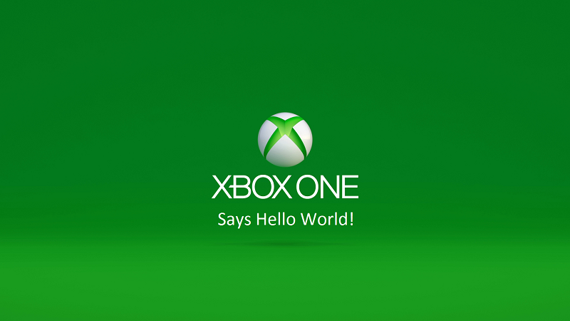

#Getting started with UWP app development on Xbox One

**Carefully** follow these steps to successfully set up your PC and Xbox One for UWP development. After you’ve got things set up, you can learn more about Developer Mode on Xbox One and building UWP apps on the [UWP for Xbox One](index.md) page. 

## Before you start
Before you start you will need to do the following:
-   Create a [Windows Dev Center](https://dev.windows.com) account.
-   Join the [Windows Insider Program](https://insider.windows.com/). You’ll need this to get the preview Windows SDK.
-   Set up a Windows 10 PC (any version will do including the most up-to-date Windows 10 insider flight) – for this preview, our development tools require you to be running Windows 10. 
-   Connect your Xbox One console to a network. For best performance, use a wired connection.
- Have at least 5 GB of free space on your Xbox One console.

## Setting up your development PC
1.  Install Visual Studio 2015 Update 2. Make sure that you choose **Custom** install and select the **Universal Windows App Development Tools** checkbox – it's not part of the default install. See [Development environment setup](development-environment-setup.md) for more information (also if you are a C++ developer make sure that you choose Custom install and select C++ too).

2.  Install the latest Windows 10 SDK preview build. You can get this from the [Windows Insider Program](http://go.microsoft.com/fwlink/p/?LinkId=780552).
  
  > **Important**
            &nbsp;&nbsp;Installing this preview SDK on your PC will prevent you from submitting apps to the store built on this PC, so don’t do this on your production development PC. 

## Setting up your Xbox One console
1.  Activate Developer Mode on your Xbox One. Download the app, get the activation code, enter it into the xboxactivate page in your Dev Center account. See [Enabling developer mode on Xbox One](devkit-activation.md) for more information. 

2.  Wait until your Xbox One takes a system update so that it's running the Developer Preview. This can take up to 4 hours. If you don’t want to wait,  “hard” reboot your console by pressing and holding the power button for 10 seconds, and then turning it back on. This will trigger the update.  

3.  Go into the Dev Mode Activation app and select **Switch and restart**. Congratulations, you now have an Xbox One in Developer Mode!
  
  > **Note**
            &nbsp;&nbsp;Your retail games and apps won’t run in Developer Mode, but the apps or games you create will. Switch back to Retail Mode to run your favorite games and apps.

## Creating your first project in Visual Studio 2015

See [Development environment setup](development-environment-setup.md) for more detailed information.

1.  For C#: Create a new Universal Windows project, go into the project properties and select the **Debug** tab, change **Target device** to **Remote Machine**, type the IP address or hostname of your Xbox One into the **Remote machine** field, and select **Universal (Unencrypted Protocol)** in the **Authentication Mode** drop-down list.   

    You can find your Xbox One IP address by starting Dev Home on your console (the big tile on the right side of Home) and looking at the top left corner. See [Introduction to Xbox One tools](introduction-to-xbox-tools.md) for more information about Dev Home.  

2.  For C++ and HTML/Javascript projects:  You follow a similar path, but in project properties go to the **Debugging** tab, select **Remote Machine** in the Debugger to open the drop-down list, type the IP address or hostname of the console into the **Machine Name** field, and select **Universal (Unencrypted Protocol)** in the **Authentication Type** field.
   
3.  When you press F5, your app will build and start to deploy on your Xbox One.
  
4.  The first time you do this, Visual Studio will prompt you for a PIN for your Xbox One. You can get a PIN by starting Dev Home on your Xbox One and pressing the **Pair with Visual Studio** button.
  
5.  After you have paired, your app will start to deploy. The first time you do this it might be a bit slow (we have to copy all the tools over to your Xbox), but if it takes more than a few minutes, something is probably wrong. Make sure that you have followed all of the steps above (particularly did you set the **Authentication Mode** to **Universal**?) and that you are using a wired network connection to your Xbox One.  

6. Sit back and relax. Enjoy your first app running on the console!  
   
   

## See also  
- [FAQ](frequently-asked-questions.md)  
- [Known issues](known-issues.md)
- [UWP on Xbox One](index.md)

<!--HONumber=Jun16_HO3-->

